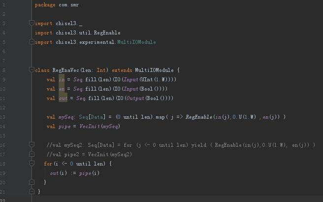

####    从命令行切到IJ-IDE了，提高下coding效率~



#### 生成的代码
```scala
module RegEnaVec( // @[:@3.2]
  input   clock, // @[:@4.4]
  input   reset, // @[:@5.4]
  input   in_0, // @[:@6.4]
  input   in_1, // @[:@7.4]
  input   in_2, // @[:@8.4]
  input   in_3, // @[:@9.4]
  input   in_4, // @[:@10.4]
  input   in_5, // @[:@11.4]
  input   in_6, // @[:@12.4]
  input   in_7, // @[:@13.4]
  input   en_0, // @[:@14.4]
  input   en_1, // @[:@15.4]
  input   en_2, // @[:@16.4]
  input   en_3, // @[:@17.4]
  input   en_4, // @[:@18.4]
  input   en_5, // @[:@19.4]
  input   en_6, // @[:@20.4]
  input   en_7, // @[:@21.4]
  output  out_0, // @[:@22.4]
  output  out_1, // @[:@23.4]
  output  out_2, // @[:@24.4]
  output  out_3, // @[:@25.4]
  output  out_4, // @[:@26.4]
  output  out_5, // @[:@27.4]
  output  out_6, // @[:@28.4]
  output  out_7 // @[:@29.4]
);
  reg  mySeq_0; // @[Reg.scala 19:20:@31.4]
  reg [31:0] _RAND_0;
  wire  _GEN_0; // @[Reg.scala 20:19:@32.4]
  reg  mySeq_1; // @[Reg.scala 19:20:@35.4]
  reg [31:0] _RAND_1;
  wire  _GEN_1; // @[Reg.scala 20:19:@36.4]
  reg  mySeq_2; // @[Reg.scala 19:20:@39.4]
  reg [31:0] _RAND_2;
  wire  _GEN_2; // @[Reg.scala 20:19:@40.4]
  reg  mySeq_3; // @[Reg.scala 19:20:@43.4]
  reg [31:0] _RAND_3;
  wire  _GEN_3; // @[Reg.scala 20:19:@44.4]
  reg  mySeq_4; // @[Reg.scala 19:20:@47.4]
  reg [31:0] _RAND_4;
  wire  _GEN_4; // @[Reg.scala 20:19:@48.4]
  reg  mySeq_5; // @[Reg.scala 19:20:@51.4]
  reg [31:0] _RAND_5;
  wire  _GEN_5; // @[Reg.scala 20:19:@52.4]
  reg  mySeq_6; // @[Reg.scala 19:20:@55.4]
  reg [31:0] _RAND_6;
  wire  _GEN_6; // @[Reg.scala 20:19:@56.4]
  reg  mySeq_7; // @[Reg.scala 19:20:@59.4]
  reg [31:0] _RAND_7;
  wire  _GEN_7; // @[Reg.scala 20:19:@60.4]
  assign _GEN_0 = en_0 ? in_0 : mySeq_0; // @[Reg.scala 20:19:@32.4]
  assign _GEN_1 = en_1 ? in_1 : mySeq_1; // @[Reg.scala 20:19:@36.4]
  assign _GEN_2 = en_2 ? in_2 : mySeq_2; // @[Reg.scala 20:19:@40.4]
  assign _GEN_3 = en_3 ? in_3 : mySeq_3; // @[Reg.scala 20:19:@44.4]
  assign _GEN_4 = en_4 ? in_4 : mySeq_4; // @[Reg.scala 20:19:@48.4]
  assign _GEN_5 = en_5 ? in_5 : mySeq_5; // @[Reg.scala 20:19:@52.4]
  assign _GEN_6 = en_6 ? in_6 : mySeq_6; // @[Reg.scala 20:19:@56.4]
  assign _GEN_7 = en_7 ? in_7 : mySeq_7; // @[Reg.scala 20:19:@60.4]
  assign out_0 = mySeq_0; // @[RegEnaVec.scala 19:13:@72.4]
  assign out_1 = mySeq_1; // @[RegEnaVec.scala 19:13:@73.4]
  assign out_2 = mySeq_2; // @[RegEnaVec.scala 19:13:@74.4]
  assign out_3 = mySeq_3; // @[RegEnaVec.scala 19:13:@75.4]
  assign out_4 = mySeq_4; // @[RegEnaVec.scala 19:13:@76.4]
  assign out_5 = mySeq_5; // @[RegEnaVec.scala 19:13:@77.4]
  assign out_6 = mySeq_6; // @[RegEnaVec.scala 19:13:@78.4]
  assign out_7 = mySeq_7; // @[RegEnaVec.scala 19:13:@79.4]
`ifdef RANDOMIZE_GARBAGE_ASSIGN
`define RANDOMIZE
`endif
`ifdef RANDOMIZE_INVALID_ASSIGN
`define RANDOMIZE
`endif
`ifdef RANDOMIZE_REG_INIT
`define RANDOMIZE
`endif
`ifdef RANDOMIZE_MEM_INIT
`define RANDOMIZE
`endif
`ifndef RANDOM
`define RANDOM $random
`endif
`ifdef RANDOMIZE
  integer initvar;
  initial begin
    `ifdef INIT_RANDOM
      `INIT_RANDOM
    `endif
    `ifndef VERILATOR
      #0.002 begin end
    `endif
  `ifdef RANDOMIZE_REG_INIT
  _RAND_0 = {1{`RANDOM}};
  mySeq_0 = _RAND_0[0:0];
  `endif // RANDOMIZE_REG_INIT
  `ifdef RANDOMIZE_REG_INIT
  _RAND_1 = {1{`RANDOM}};
  mySeq_1 = _RAND_1[0:0];
  `endif // RANDOMIZE_REG_INIT
  `ifdef RANDOMIZE_REG_INIT
  _RAND_2 = {1{`RANDOM}};
  mySeq_2 = _RAND_2[0:0];
  `endif // RANDOMIZE_REG_INIT
  `ifdef RANDOMIZE_REG_INIT
  _RAND_3 = {1{`RANDOM}};
  mySeq_3 = _RAND_3[0:0];
  `endif // RANDOMIZE_REG_INIT
  `ifdef RANDOMIZE_REG_INIT
  _RAND_4 = {1{`RANDOM}};
  mySeq_4 = _RAND_4[0:0];
  `endif // RANDOMIZE_REG_INIT
  `ifdef RANDOMIZE_REG_INIT
  _RAND_5 = {1{`RANDOM}};
  mySeq_5 = _RAND_5[0:0];
  `endif // RANDOMIZE_REG_INIT
  `ifdef RANDOMIZE_REG_INIT
  _RAND_6 = {1{`RANDOM}};
  mySeq_6 = _RAND_6[0:0];
  `endif // RANDOMIZE_REG_INIT
  `ifdef RANDOMIZE_REG_INIT
  _RAND_7 = {1{`RANDOM}};
  mySeq_7 = _RAND_7[0:0];
  `endif // RANDOMIZE_REG_INIT
  end
`endif // RANDOMIZE
  always @(posedge clock) begin
    if (reset) begin
      mySeq_0 <= 1'h0;
    end else begin
      if (en_0) begin
        mySeq_0 <= in_0;
      end
    end
    if (reset) begin
      mySeq_1 <= 1'h0;
    end else begin
      if (en_1) begin
        mySeq_1 <= in_1;
      end
    end
    if (reset) begin
      mySeq_2 <= 1'h0;
    end else begin
      if (en_2) begin
        mySeq_2 <= in_2;
      end
    end
    if (reset) begin
      mySeq_3 <= 1'h0;
    end else begin
      if (en_3) begin
        mySeq_3 <= in_3;
      end
    end
    if (reset) begin
      mySeq_4 <= 1'h0;
    end else begin
      if (en_4) begin
        mySeq_4 <= in_4;
      end
    end
    if (reset) begin
      mySeq_5 <= 1'h0;
    end else begin
      if (en_5) begin
        mySeq_5 <= in_5;
      end
    end
    if (reset) begin
      mySeq_6 <= 1'h0;
    end else begin
      if (en_6) begin
        mySeq_6 <= in_6;
      end
    end
    if (reset) begin
      mySeq_7 <= 1'h0;
    end else begin
      if (en_7) begin
        mySeq_7 <= in_7;
      end
    end
  end
endmodule
```