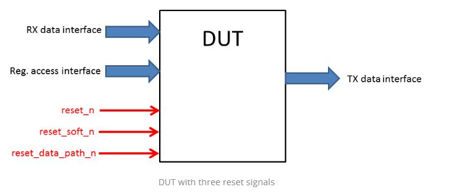
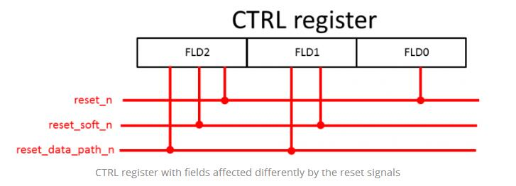

UVM registers model comes with a very simple and quite useful feature: **it supports more than one reset signal**.

Let’s say that we have an RTL with 3 input signals:



Inside this RTL, among others, we have a register called CTRL, with three fields, affected differently by the reset signals:


We can see in the image above that:

- register field FLD0 is affected by reset **reset_n**
- register field FLD1 is affected by reset **reset_soft_n** and **reset_data_path_n**
- register field FLD2 is affected by reset **reset_n**, **reset_soft_n** and **reset_data_path_n**

Let’s see how we can properly model this register.

The UVM register field class ([uvm_reg_field](http://www.specman-verification.com/source_bank/uvm-1.1/src/reg/uvm_reg_field.svh.php)) has inside an associative array called **m_reset**:

```verilog
local uvm_reg_data_t  m_reset[string];
```

The mechanism is very simple. Each reset signal is represented my a name, a string. This **m_reset** holds the value which will be loaded in the register field when a reset with a particular name will come.

So let’s give some names to each of our three reset signals:

- reset_n => “HARD”
- reset_soft_n => “SOFT”
- reset_data_path_n => “DATA_PATH”

The API of [uvm_reg_field](https://www.vmmcentral.org/uvm_vmm_ik/files3/reg/uvm_reg_field-svh.html) contains several functions with which we can access this **m_reset**.

For setting a value in this **m_reset** you can use **set_reset()** function:

```verilog
virtual function void set_reset(uvm_reg_data_t value, string kind = "HARD");
```

**kind** is the key used in **m_reset** associative array. Notice its default value: “**HARD**“. You should use this name all the time for one of your DUT reset signal as it will make your life easier when you use **configure()** function.

An other function which adds a value in **m_reset** is **configure()**:

```verilog
function void uvm_reg_field::configure(uvm_reg parent,
                                       int unsigned   size,
                                       int unsigned   lsb_pos,
                                       string         access,
                                       bit            volatile,
                                       uvm_reg_data_t reset,
                                       bit            has_reset,
                                       bit            is_rand,
                                       bit            individually_accessible);
```

When you call **configure()** function with **has_reset** equal to 1 it will add in **m_reset** the value specified with **reset** parameter associated to name “HARD”. In other words will do the following call:

```verilog
set_reset(reset, "HARD");
```

Knowing these two functions is all you need in order to model the register fields correctly.

FLD0 is only affected by reset “HARD” so the quickest way to model this is when we call **configure()** function. So let’s set it up to be reset to value 8’01 when “HARD” reset becomes active:

```verilog
//use has_reset = 1 so that the register field
//will be loaded with value8'h01 at "HARD" reset
fld0.configure(8, 0, "RW", 0, 8'h01, 1, 1, 1);
```

FLD1 is affected by “SOFT” and “DATA_PATH”. So we can call **configure()** with **has_reset** = 0 as this field is not affected by “HARD” reset and then call **set_reset()** to configure the two reset values for each reset signal:

```verilog
//use has_reset = 0 as "HARD" reset does not affect this field
fld1.configure(4, 8, "RW", 0, 0, 0, 1, 1);

//register field will be loaded with value 4'hF at "SOFT" reset
fld1.set_reset(4'hF, "SOFT");

//register field will be loaded with value 4'hC at "DATA_PATH" reset
fld1.set_reset(4'hC, "DATA_PATH");
```

FLD2 is affected by all resets:

```verilog
//register field will be loaded with value 8'h11 at "HARD" reset
fld1.configure(4, 8, "RW", 0, 8'h11, 1, 1, 1);

//register field will be loaded with value 8'h23 at "SOFT" reset
fld2.set_reset(8'h23, "SOFT");

//register field will be loaded with value 8'h00 at "DATA_PATH" reset
fld2.set_reset(8'h00, "DATA_PATH");
```

All we need to do is call the [reset()](https://www.vmmcentral.org/uvm_vmm_ik/files3/reg/uvm_reg_block-svh.html#uvm_reg_block.reset) function of the register block whenever we detect a particular reset:

```verilog
fork
   begin
      forever begin
         @(negedge vif.reset_n);
         //default value of kind is "HARD" so you can also call reset() with no argument
         reg_block.reset("HARD");
      end
   end
   begin
      forever begin
         @(negedge vif.reset_soft_n);
         reg_block.reset("SOFT");
      end
   end
   begin
      forever begin
         @(negedge vif.reset_data_path_n);
         reg_block.reset("DATA_PATH");
      end
   end
join
```

That’s it!
This is all you need to do to model register fields which are affected differently by different reset signals.

### QA 

What about a dynamic reset (in same cases we can have a reset value via a HW pin signal), do you have an idea how we can mimic UVM side ?

### ANS

I think the best way in my opinion is to override the function [get_reset()](https://verificationacademy.com/verification-methodology-reference/uvm/docs_1.1d/html/files/reg/uvm_reg_field-svh.html#uvm_reg_field.get_reset) of the [uvm_reg_field](https://verificationacademy.com/verification-methodology-reference/uvm/docs_1.1d/html/files/reg/uvm_reg_field-svh.html) class.

```verilog
virtual function uvm_reg_data_t get_reset(string kind = "HARD");
   if(kind == "HARD") begin
      //get via a virtual interface the value from the HW pin signal
      return vif.lfd_reset_value_i;
   end
   else begin
      return super.get_reset(kind);
   end
endfunction
```

