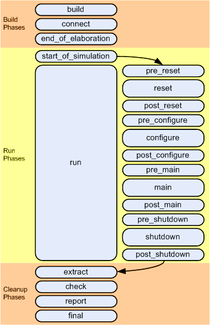

## 1) Introduction:

One of the fundamental requirement in Electronic Design is to put the Design into a **known state** after the power is switched **ON**. This process of putting the Design into a known state is technically synchronized & achieved using a dedicated signal popularly called “**Reset**” signal. We know that after power is switched ON, we **Assert** the Reset signal to the Design to put it into a known state and after certain time (usually in terms of number of clocks) the Reset signal is **De-asserted** to bring the Design Under Test (DUT) out of Reset. Assertion or De-assertion of Reset signal will depend on **Active HIGH** or **Active LOW** conditions. It is expected that after Reset signal is De-asserted, DUT achieves the known state as per the **specification** of the Design. So this is a simplified way to explain “How Reset signal directly relates to a Design’s operation”.

## 2) Reset generation for Module Verification by UVC:

To verify the **Design Under Test** (DUT), we know, we construct a **Verification Environment** aka **Testbench** around the DUT which may contains several Components or Transactors serving multiple purposes or tasks supporting the activities happening inside the Verification Environment. If you have not already visited, you may like to refer one of my previous posts to know more about the UVM Verification Components. In the whole given Testbench setup, once Reset process is started, the default state of the Testbench components as well as DUT needs to be achieved. The Reset process could be triggered by the **initial Reset** or **intermediate Reset** occurred during the Sequences execution in UVM. Since multiple Resets can occur in a single simulation, hence we should ensure that the DUT and Testbench can handle multiple Reset conditions.

In this post, we’ll see how to generate the Reset signal from the **UVC**(Universal Verification Component) which is also popularly called **VIP**(Verification IP) developed using **UVM**. The primary focus in this post is – How to use the **UVM Phasing Mechanism** to generate the Reset Assertion and De-Assertion conditions. Along with Reset generation, we’ll also see – How to handle the **Reset handling** inside UVM Testbench components like **Driver, Monitor, Scoreboard & Sequences** along with smooth resetting of various defined **Variables, Data Structures e.g. Queues, Arrays** and/or **temporary Memory elements** whichever exists as part of the Testbench.

## 3) UVM Phases:

Since we’re going to use UVM Phases to handle Reset generation, so at this point, lets quickly recap the UVM Phases here in brief:

For more detailed information on **UMV Phases**, you may like to visit my another post i.e. UVM Phasing.

Broadly UVM Phases are categorized into **3 categories**:

1. **Build Phases**
2. **Run Phases**
3. **Clean-up Phases**

Let’s see these categories using Figure 1 shown below:



​                                                     **Figure 1: UVM Phases (with reset phase)**

In the above Figure 1, we can see that **Run Phase** is partitioned into **12 Sub-phases**. All of these 12 Sub-phases are “**tasks**” in nature. It means, time can be consumed by these Sub-phases.

Since we know that **UVM foundation principle** is the **automated flow of execution** of these **3 Phases i.e. Build, Run & Cleanup Phases** & the proper synchronization between the Phases. There is an order of execution of different Phases which is shown in the above **Figure 1**. The execution sequence is designed by the Industry Experts  to cater the need of a Design to be verified. **All the 12 Run Sub-phases executes in the shown order.** It means once the Build Phases is over, the first Sub-phase in the Run Phase is “**Reset**” Phase. This Phase is being partitioned further into 3 Sub-phase i.e. **pre_reset_phase()**, **reset_phase()** & **post_reset_phase()**.

## 4) Reset generation using UVM reset_phase() Phase:

Lets first see the definitions of **3 UVM Reset Sub-phases**:

------

### pre_reset:

pre_reset phase starts at the same time as the run phase. Its purpose is to take care of any activity that should occur before the reset. E.g. waiting for a power signal to go active.

### reset:

As name indicates, reset phase is specially for DUT or Interface specific reset behavior. This phase would be used to generate reset to put the DUT/Interface into a default state.

### post_reset:

This phase is intended for any activity required just after the reset phase.

------

Since all the Run Sub-phase are to be declared as **Tasks** & we know that a Task **can consume time** in the simulation process. Hence we can utilize the **reset_phase()** task to generate the Reset from the **UVC**. Both **pre_reset_phase()** and **post_reset_phase()** are there to **support** the Reset process in the environment.

Lets see below a piece of UVM code to comprehend it more clearly:

#### Driver Code:

------

```verilog
/// Driver Definition 
class my_driver extends uvm_driver #(my_transaction);
   `uvm_component_utils(my_driver)

...
...

  /// Pre-reset Phase Task 
task pre_reset_phase (uvm_phase phase);
  phase.raise_objection(this);
  dut_vi.reset = 1'b1;
  #1;
  phase.drop_objection(this);
endtask: pre_reset_phase

/// Reset Phase Task, reset is Active LOW
task reset_phase(uvm_phase phase);
  phase.raise_objection(this);
  dut_vi.reset = 1'b0;
  #13;
  dut_vi.reset = 1'b1;
  phase.drop_objection(this);
endtask: reset_phase 

endclass: my_driver
```

------

From the above UVM Driver code inside the **reset_phase**(), its evident that Reset signal (i.e. **dut_vi.reset**) will be driven **LOW** (Active LOW) to assert the Reset and after some time (i.e. **13ns**) the Reset signal is driven **HIGH**to de-assert the Reset and DUT will be out of reset at this point of time.

Note: “**dut_vi**” is the **Virtual Interface declaration** made inside the **Driver**.

## 5) Multiple Reset generation using UVM Phasing:

We’ve seen above how to generate the Reset after the power is ON. There is a Test scenario where we may want to reset the DUT after the 1st Sequence is over & run the same or different Sequence to test DUT behavior without getting it power down. So basically a new Reset is triggered without coming out of the UVM Phases.

Following UVM code inside the “**Test”** can be helpful to achieve this:

------

```verilog
 /// Test Definition
class my_test extends uvm_test;
 `uvm_component_utils(my_test)

...
...

/// phase_ready_to_end function
 function void phase_ready_to_end(uvm_phase phase);
   super.phase_ready_to_end(phase);
    if(phase.get_imp() == uvm_shutdown_phase::get()) begin
     if (run_count <= `no_of_runs) begin
      phase.jump(uvm_pre_reset_phase::get());
      run_count++;
    end
   end 
 
  endfunction

endclass: my_test
```

------

We know in UVM, the Test ending mechanism is via **Raise Objections** and **Drop Objections**. So the indication of finishing a Sequence is that all the Raised Objections are Dropped and the Objection counter value will be **zero** at this point. Now **phase_ready_to_end**() function defined above comes into action. **phase_ready_to_end**() is called whenever the total objection count for the current phase decrements to **0**.

From the above code, its clear that once the phase is **shutdown_phase**(which is last Sub-phase out of the 12 Run Sub-phases) & there is no pending Objection, phase_ready_to_end is activated and make a **JUMP** to the **pre_reset_phase()**. From there on, the whole cycle is repeated. This way, the whole process is **re-started again** & a new RESET is generated.

This approach can be further extended to Test the scenario where Reset is triggered in-between of the Sequence execution instead of after completing the Sequence.

## 6) Reset handling for different Testbench components:

Once Reset is generated inside the UVM Testbench Environment, we must take care of various different **Testbench component’s** behavior with respect to the Reset signal.  Following components (**Static or Dynamic**) needs to be prepared for Reset handling:

- **Monitor**
- **Sequencer**
- **Scoreboard**
- **Sequences**
- **Assertions**

Now, lets see what can be done to make these UVM components Reset ready:

### Monitor:

Whether the UVM Agent is **ACTIVE** or **PASSIVE**, a Monitor needs to be present in both of them. Monitor’s primary job is to receive the pin-level interface signals and based on the other Control signals like “**valid_txn**” or **any other** it transforms the **pin-level signals** into **Transaction Objects**. So as soon as the Reset signal is asserted, Monitor should disable the process of collection data from the Interfaces.

Lets see how this is achieved using the UVM code for Monitor:

------

```verilog
/// Monitor Defintion
class my_monitor extends uvm_monitor #(my_transaction);
 `uvm_component_utils(my_monitor)

...
...
 
 /// Run Task
  task run_phase (uvm_phase phase);
   forever begin
   @(posedge dut_vi.reset);
   fork
     monitor_items();
   join_none
 
   @(negedge dut_vi.reset);
    disable fork;
   end
  endtask: run_phase

endclass: my_monitor
```

------

Here we can see that inside the **run_phase** task **forever** loop, **monitor_items**() task is waiting for the **dut_vi.reset** signal **positive** edge (Reset de-asserted for Active LOW reset). Once the condition met, monitor_items is spawned from the fork..join_none and Monitor starts collecting the transactions. Now if there is any upcoming or intermediate Reset comes in  i.e. the **negedge** of the **dut_vi.reset** (Active LOW), the **fork process** is **disabled** which stops the monitor_items task. This is exactly what we want when RESET occurs i.e. not to collect any transactions either from Input or Output ports because only valide transactions have to be passed to the Scoreboard.

### Sequencer:

UVM Phases are very handy & automated in terms of handling different UVM components. Whenever there is UVM Phase **JUMP** instruction (as shown in point 5 above) it stops all the ongoing transactions and clears out the **internal FIFOs** which are involved to hold the running transactions on that Sequencer.

### Scoreboard:

Usually **Queues**, the **data structure**, being used inside the Scoreboards to hold the **incoming stream of transactions**. Once Reset occurs in the system, the declared Queues inside the Scoreboard MUST be cleared and all the existing elements needs to be flushed out. Since Scoreboard does not have direct access to the Interface and it works with UVM **analysis imports** and deals with **transaction objects.** Now again, we can utilize UVM Phases which are **automated** in terms of execution. So **Queues** can be flushed out once **pre_reset_phase()** occurs. It’ll be helpful in multiple RESET generation scenario.

------

```verilog
/// Scoreboard Definition
class my_scoreboard extends uvm_scoreboard;
  `uvm_component_utils(my_scoreboard)
 
  ...
  ...

  /// A Queue declaration to hold DUT I/P & O/P data
  my_transaction scb_q [$];
  my_transaction scb_q_o [$];

  /// During reset phase Queues must be cleaned
  task pre_reset_phase (uvm_phase phase);
   scb_q.delete();
   scb_q_o.delete();
  endtask

endclass: my_scoreboard
```

------

### Sequence:

Sequence is the UVM Environment **dynamic** **component** which generates Stimulus for the DUT. In terms of **multiple Reset handling**, definitely Sequence **must be stopped** once Reset is asserted and Sequence should be restarted automatically once Reset is de-asserted. UVM Phases can help us greatly to achieve what is expected out here.

Lets see below the UVM code for the **Test**:

------

```verilog
/// Test Definition
class my_test extends uvm_test;
  `uvm_component_utils(my_test)

...
...
/// Main Phase Task
 virtual task main_phase(uvm_phase phase);
   my_sequence seq;
   seq = my_sequence::type_id::create("seq");
   if( !seq.randomize() ) 
     `uvm_error("", "Randomize failed")
   seq.starting_phase = phase;
   phase.raise_objection(this);
   seq.start( m_env.m_agnt.m_seqr );
   phase.drop_objection(this);
 endtask

endclass: my_test
```

------

In the above UVM Test code, Sequence is started on the **Sequencer** i.e. **m_seqr** once the **main_phase** is entered. So if we’re able to recycle the UVM Phasing flow, Sequence will be automatically started on the defined Sequencer.

### Assertions:

We know that Assertions are to capture the live status of signals weather its **Immediate** or **Concurrent** Assertions. Assertions are most commonly used as **Interface Protocol Checkers** & are placed inside the **Interfaces**or **Monitors**. Once **Reset** appears, we might want to **kill** the running Assertions. This can be achieved by adding following code:

```verilog
/// Assertion 1: grant0 & grant1 should NOT be asserted together
 assert property (@(posedge clk) 
                  disable iff (~reset) !(grant0 & grant1));
```

In the above code, once Reset appears (Active LOW), this Assertion/Property will be **disabled** and will not check the required condition. It will avoid flashing **false errors** during the **RESET** period.

------

With this, we reached to the end of this post. I would like to conclude here this post on “**How to handle Reset using UVM Phasing**“.

As a recap, we discussed how to utilize the automated & sequential Phase based execution flow and use how to use **reset_phase**() inside a UVM **Driver** to generate Reset. We touched base with different UVM Phases. We discussed how to generate multiple Resets once a Sequence is executed. Later we analyzed the different UVM environment components which needs attention & work towards Reset handling situations.