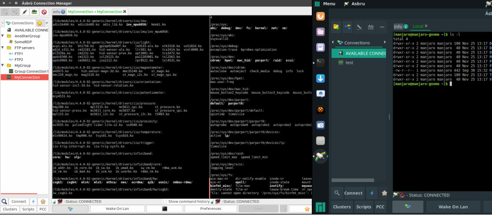

+ 最近经常用Linux系统做终端连接服务器，用惯了xshell，实在不习惯ssh+tmux流，找了个替代品~~~
+ ubuntu安装

```shell
curl -s https://packagecloud.io/install/repositories/asbru-cm/asbru-cm/script.deb.sh |sudo bash
sudo apt install asbru-cm
```

* 界面

  

