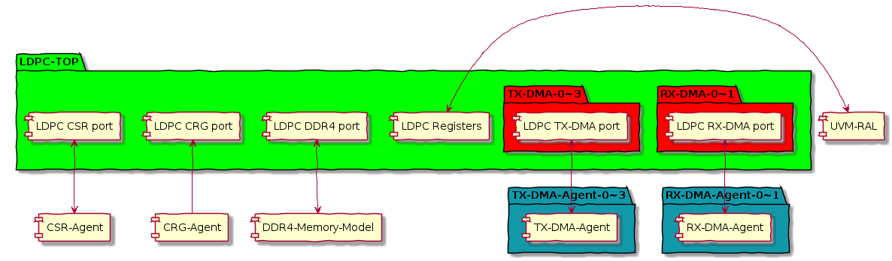
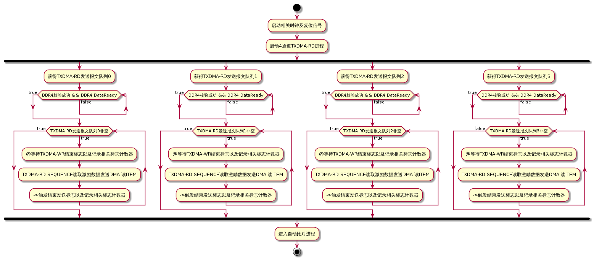

###  结构图

```php+HTML
@startuml
skinparam handwritten true
skinparam package  {
BackgroundColor #00ff00
}

package "LDPC-TOP" {


[LDPC CSR port]
package "TX-DMA-0~3" #red {
   [LDPC TX-DMA port]
}
package "RX-DMA-0~1" #red {
   [LDPC RX-DMA port]
}
[LDPC CRG port] 
[LDPC DDR4 port] 
[LDPC Registers]

}
package "TX-DMA-Agent-0~3" #1199AA {
    [LDPC TX-DMA port] <-down-> [TX-DMA-Agent]
}
package "RX-DMA-Agent-0~1" #1199AA {
    [LDPC RX-DMA port] <-down-> [RX-DMA-Agent]
}
  [LDPC CSR port] <-down-> [CSR-Agent]
  [LDPC CRG port]  <-down- [CRG-Agent]
  [LDPC DDR4 port] <-down-> [DDR4-Memory-Model]
  [LDPC Registers] <-right-> [UVM-RAL]

@enduml
```



### 流程图
```php+HTML
@startuml

start
:启动相关时钟及复位信号;
:启动4通道TXDMA-RD进程;
fork

:获得TXDMA-RD发送报文队列0;
while (DDR4校验成功 && DDR4 DataReady) is (false)
endwhile (true)

while (TXDMA-RD发送报文队列0非空) is (true)
:@等待TXDMA-WR结束标志以及记录相关标志计数器;
:TXDMA-RD SEQUENCE读取激励数据发送DMA 读ITEM;
:->触发结束发送标志以及记录相关标志计数器;
endwhile (true)
fork again
:获得TXDMA-RD发送报文队列1;
while (DDR4校验成功 && DDR4 DataReady) is (false)
endwhile (true)

while (TXDMA-RD发送报文队列1非空) is (true)
:@等待TXDMA-WR结束标志以及记录相关标志计数器;
:TXDMA-RD SEQUENCE读取激励数据发送DMA 读ITEM;
:->触发结束发送标志以及记录相关标志计数器;
endwhile (true)
fork again
:获得TXDMA-RD发送报文队列2;

while (DDR4校验成功 && DDR4 DataReady) is (false)
endwhile (true)

while (TXDMA-RD发送报文队列2非空) is (true)
:@等待TXDMA-WR结束标志以及记录相关标志计数器;
:TXDMA-RD SEQUENCE读取激励数据发送DMA 读ITEM;
:->触发结束发送标志以及记录相关标志计数器;
endwhile (true)

fork again
:获得TXDMA-RD发送报文队列3;
while (DDR4校验成功 && DDR4 DataReady) is (false)
endwhile (true)

while (TXDMA-RD发送报文队列3非空) is (true)
:@等待TXDMA-WR结束标志以及记录相关标志计数器;
:TXDMA-RD SEQUENCE读取激励数据发送DMA 读ITEM;
:->触发结束发送标志以及记录相关标志计数器;
endwhile (false)

end fork

:进入自动比对进程;

stop

@enduml
```

