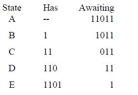

### 转载

Beginning with the simple theory about Sequence Detector. A sequence detector an algorithm which detects a sequence within a given set of bits. Of course the length of total bits must be greater than sequence that has to be detected.

Sequence detector basically is of two types –

1. Overlapping

2. Non Overlapping

In overlapping some of the last bits can also be used for the start of detection of next sequence within the given bits.

Now lets work on overlapping concept.

We have 5 bits here in 11011 hence we will have 5 states. Let em be A/B/C/D and E.

Initially pstate will be A.

Now

1. Incoming bit is 1 (from 1101101101101101) and it matches with first bit of sequence hence jump to next B. Requirement(1011)

2. Incoming bit is 1 (from 1101101101101101)and it matches with  first bit of requirement hence jump to state C. Requirement (011)

3. Incoming bit is 0 (from 1101101101101101) and it matches with first bit of requirement hence jump to state D. Requirement (11)

4. Incoming bit is 1 (from 1101101101101101) and it matches with first bit of requirement hence jump to state E. Requirement (1)

5. Incoming bit is 0 (from 1101101101101101) and it matches with first bit of requirement hence jump to state A. Requirement (). Output is 1 as we have found a sequence

To be more clear here is a table-a：

Notice that state C has 11 and requires 011. Now if it receives 1 instead of zero then instead of resetting and going back to A it will remain at C because C has 11 which can be used for starting of 11011 . This is called Overlapping. Similarly after state E we have restart to detect sequence then instead of starting again from A we will jump to C since it already has some bits which can serve as starting point. Remember always jump to that state which can provide **maximum** starting bits of sequence . Here B has 1 which can also serve but it isn’t maximum.

Here is the state diagram for this sequence. I am pretty sure you must have understood Overlapping till now. If No! you can contact or this state diagram should suffice.

Let's go step by step

(A) Idle state is A waiting for 1 which if it gets will jump to B else will remain to A

(B) If receives 1 will jump to C else will jup back to idle A 

(C) If receives 1 will remain at itself as it has 11 to start with however if it receives  0 then it will jump to state D

(D) If receives 0 will jump to state A else will jump to state E

(E) If receives 0 will jump to A else will jump to Cand output will be 1 which  means that a sequence has been detected.

Now how many FFs do we require to make this machine. We have 5bits here so by using this equation we can find

$$
2^{x-1} < 5 < 2^{x}
$$

Thus we get X = 3 hence 3 FFs
Here is the State Table for this question
