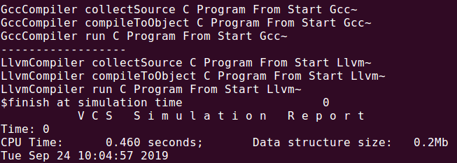

#### 模板模式，一个抽象类公开定义了执行它的方法的方式/模板。它的子类可以按需要重写方法实现，但调用将以抽象类中定义的方式进行。这种类型的设计模式属于行为型模式。

```verilog
package template_pkg;

    virtual class CompilerInterface;
     
    	pure virtual function void collectSource(string msg);
    	pure virtual function void compileToObject(string msg);
    	pure virtual function void run(string msg);
    	virtual function void compileAndRun(string msg);
            this.collectSource(msg);
            this.compileToObject(msg);
            this.run(msg);
        endfunction
    
    endclass
    
    class GccCompiler extends CompilerInterface;
        
        virtual function void collectSource(string msg);
            $display("GccCompiler collectSource C Program From %s",msg);
        endfunction
    	virtual function void compileToObject(string msg);
            $display("GccCompiler compileToObject C Program From %s",msg);
        endfunction
    	virtual function void run(string msg);
            $display("GccCompiler run C Program From %s",msg);
        endfunction
    
    endclass
    
    class LlvmCompiler extends CompilerInterface;
        
        virtual function void collectSource(string msg);
            $display("LlvmCompiler collectSource C Program From %s",msg);
        endfunction
    	virtual function void compileToObject(string msg);
            $display("LlvmCompiler compileToObject C Program From %s",msg);
        endfunction
    	virtual function void run(string msg);
            $display("LlvmCompiler run C Program From %s",msg);
        endfunction
    
    endclass

endpackage:template_pkg

program TBProgram import template_pkg::*;;

    initial begin
        automatic CompilerInterface gcc  = GccCompiler::new();
        automatic CompilerInterface llvm  = LlvmCompiler::new();
        gcc.compileAndRun("Start Gcc~");
        $display("------------------");
        llvm.compileAndRun("Start Llvm~");
    end

endprogram
```

#### 仿真Demo

