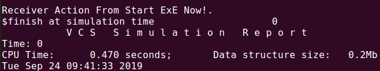

#### 命令模式是一种数据驱动的设计模式，它属于行为型模式。请求以命令的形式包裹在对象中，并传给调用对象。调用对象寻找可以处理该命令的合适的对象，并把该命令传给相应的对象，该对象执行命令。

```verilog
package cmd_pkg;

    virtual class CmdInterface;
     
    	pure virtual function void execute(string msg);
    
    endclass
    
    class Receiver;
        
    	virtual function void action(string msg);
            $display("Receiver Action From %s.",msg);
        endfunction
    
    endclass
    
    class ConcreteCmd extends CmdInterface;
        
        Receiver recv ;
    
        function new(Receiver recv);
            this.recv = recv;
        endfunction
    
    	virtual function void execute(string msg);
            this.recv.action(msg);
        endfunction
    
    endclass


    class Invoker;
    
        CmdInterface cmd ;
    
        function command(CmdInterface cmd);
            this.cmd = cmd;
        endfunction
    
        virtual function void execute(string msg);
            this.cmd.execute(msg);
        endfunction
        
    endclass


endpackage:cmd_pkg

program TBProgram import cmd_pkg::*;;

    initial begin
        automatic Receiver recv = Receiver::new();
        automatic CmdInterface cmd = ConcreteCmd::new(recv);
        automatic Invoker ivk = Invoker::new();
        ivk.command(cmd);
        ivk.execute("Start ExE Now!");
    end

endprogram
```

#### 仿真Demo

