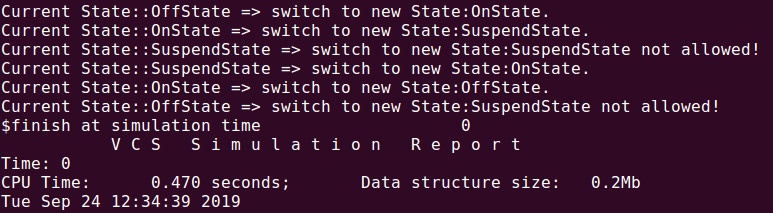

#### 在状态模式中，类的行为是基于它的状态改变的。这种类型的设计模式属于行为型模式。

```verilog
package fsm_pkg;

    import uvm_pkg::*;
    `include "uvm_macros.svh"
    
    typedef class OffState;
    typedef class OnState;
    typedef class SuspendState;
    
    class ComputerState;
    
        string name;
        string allowed[string];
     
    	virtual function ComputerState switch(ComputerState state);
            if(this.allowed.exists(state.name)) begin
                ComputerState st;
                $display("Current State::%s => switch to new State:%s.",name,state.name);
                if(this.allowed[state.name] == "OffState") 
                    st = OffState::new();
                else if(this.allowed[state.name] == "OnState")
                    st = OnState::new();
                else if(this.allowed[state.name] == "SuspendState")
                    st = SuspendState::new();
                return st;
            end
            else begin
                $display("Current State::%s => switch to new State:%s not allowed!",name,state.name);
                return this;
            end
        endfunction
    
    endclass
    
    class OffState extends ComputerState;
    
        function new();
            this.name = "OffState";
            this.allowed["OnState"] = "OnState";
        endfunction
    
    endclass
    
    class OnState extends ComputerState;
        
        function new();
            this.name = "OnState";
            this.allowed["OffState"] = "OffState";
            this.allowed["SuspendState"] = "SuspendState";
        endfunction
    
    endclass
    
    class SuspendState extends ComputerState;
        
        function new();
            this.name = "SuspendState";
            this.allowed["OnState"] = "OnState";
        endfunction 
    
    endclass
    
    class Computer;
    
        ComputerState m_state;
    
        function new(ComputerState state = null);
            if(state == null)
                this.m_state = OffState::new();
            else
                this.m_state = state;
        endfunction
    
    	virtual function void change(ComputerState state);
            this.m_state = this.m_state.switch(state);
        endfunction
    
    endclass

endpackage:fsm_pkg

program TBProgram import fsm_pkg::*;;

    initial begin
        automatic Computer comp = Computer::new();
        automatic OnState on = OnState::new();
        automatic OffState off = OffState::new();
        automatic SuspendState sus = SuspendState::new();
        comp.change(on);
        comp.change(sus);
        comp.change(sus);
        comp.change(on);
        comp.change(off);
        comp.change(sus);
    end

endprogram
```
#### 仿真Demo


