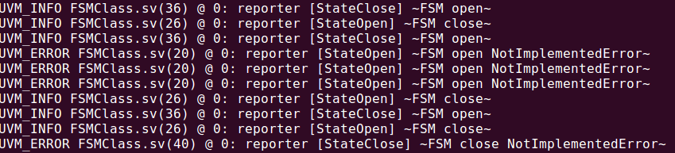

#### FSM的高层实现，应对特殊的仿真场景~

```verilog
package fsm_pkg;

    import uvm_pkg::*;
    `include "uvm_macros.svh"
    
    typedef class FSMClass;
    typedef class StateOpen;
    typedef class StateClose;
    
    virtual class StateClass;
     
    	pure virtual function void open(FSMClass newstate);
        pure virtual function void close(FSMClass newstate);
    
    endclass
    
    class StateOpen extends StateClass;
    
    	virtual function void open(FSMClass newstate);
            `uvm_error("StateOpen","~FSM open NotImplementedError~");
    	endfunction
    
        virtual function void close(FSMClass newstate);
            StateClose close_st = new;
    		newstate.new_state(close_st);
            `uvm_info("StateOpen","~FSM close~",UVM_LOW);
    	endfunction
    
    endclass
    
    class StateClose extends StateClass;
    
    	virtual function void open(FSMClass newstate);
            StateOpen open_st = new;
    		newstate.new_state(open_st);
            `uvm_info("StateClose","~FSM open~",UVM_LOW);
    	endfunction
    
        virtual function void close(FSMClass newstate);
            `uvm_error("StateClose","~FSM close NotImplementedError~");
    	endfunction
    
    endclass
    
    class FSMClass;
    
    	local StateClass _state;
    
    	function new(StateClass newstate = null);
            if(newstate == null) begin
                StateClose close_st = new;
                this.new_state(close_st);
            end
            else
                this.new_state(newstate);
    	endfunction
    
        virtual function void new_state(StateClass newstate);
            this._state = newstate;
    	endfunction
    
        function FSMClass open();
            this._state.open(this);
            return this;
    	endfunction
    
        function FSMClass close();
            this._state.close(this);
            return this;
    	endfunction
    
    endclass

endpackage:fsm_pkg

program TBProgram import fsm_pkg::*;;

    initial begin
        automatic FSMClass fsm = new;
        fsm.open().close();
        fsm.open().open();
        fsm.open().open().close();
        fsm.open().close().close();
    end

endprogram
```
### 运行demo

