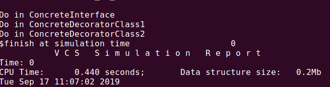

#### 装饰器模式进行扩展功能而不需要修改原代码。
```verilog
package decorator_pkg;


    virtual class BaseInterface;
     
    	pure virtual function void doFunc();
    
    endclass
    
    class ConcreteInterface extends BaseInterface;
    	
        virtual function void doFunc();
            $display("Do in ConcreteInterface");
        endfunction

    endclass
    
    class DecoratorClass extends BaseInterface;
        
        BaseInterface m_bdc;

        function new(BaseInterface bdc);
            this.m_bdc = bdc;
        endfunction 

        virtual function void doFunc();
            m_bdc.doFunc();
        endfunction

    endclass

    class ConcreteDecoratorClass1 extends DecoratorClass;
        
        function new(BaseInterface bdc);
            super.new(bdc);
        endfunction 
        
        virtual function void doFunc();
            super.doFunc();
            $display("Do in ConcreteDecoratorClass1");
        endfunction

    endclass

    class ConcreteDecoratorClass2 extends DecoratorClass;
        
        function new(BaseInterface bdc);
            super.new(bdc);
        endfunction 
        
        virtual function void doFunc();
            super.doFunc();
            $display("Do in ConcreteDecoratorClass2");
        endfunction

    endclass


endpackage:decorator_pkg

program TBProgram import decorator_pkg::*;;

    initial begin
        automatic BaseInterface bif1 = ConcreteInterface::new();
        automatic BaseInterface bif2 = ConcreteDecoratorClass1::new(bif1);
        automatic BaseInterface bif3 = ConcreteDecoratorClass2::new(bif2);
        bif3.doFunc();
    end


endprogram
```

