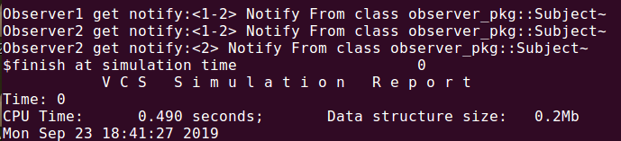

####  观察者模式可以在注册、触发中起到不错的作用。

```verilog
package observer_pkg;

    virtual class ObserverInterface;
     
    	pure virtual function void notify(string msg);
    
    endclass
    
    class Subject;
        
        local ObserverInterface m_observers[ObserverInterface];
    
        function void register(ObserverInterface observer);
            this.m_observers[observer] = observer;
        endfunction
    
        function void unregister(ObserverInterface observer);
            this.m_observers.delete(observer);
        endfunction
    	
        function void notifyAll(string msg);
            foreach(this.m_observers[i])
                this.m_observers[i].notify(msg);
        endfunction
    
    endclass
    
    class Observer1 extends ObserverInterface;
        
        function new(ref Subject subject);
            subject.register(this);
        endfunction
    	
        function void notify(string msg);
            $display("Observer1 get notify:%s~",msg);
        endfunction
    
    endclass
    
    class Observer2 extends ObserverInterface;
        
        function new(ref Subject subject);
            subject.register(this);
        endfunction
    	
        function void notify(string msg);
            $display("Observer2 get notify:%s~",msg);
        endfunction
    
    endclass


endpackage:observer_pkg

program TBProgram import observer_pkg::*;;

    initial begin
        automatic Subject subj = Subject::new();
        automatic Observer1 obs1 = Observer1::new(subj);
        automatic Observer2 obs2 = Observer2::new(subj);
        subj.notifyAll($sformatf("<1-2> Notify From %s",$typename(Subject)));
        subj.unregister(obs1);
        subj.notifyAll($sformatf("<2> Notify From %s",$typename(Subject)));
    end

endprogram
```
#### 仿真Demo
