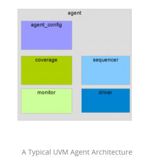

Even if it sounds like something quite simple, handling reset in an [UVM](http://www.accellera.org/downloads/standards/uvm) agent is not that trivial when it comes to actual implementation.
In this post I will present a generic mechanism for handling reset which can be reused in any UVM agent.

Let’s consider that we have an UVM agent with the following architecture:



### Step #1: Handling Reset in the Agent Component

Because the agent is the top component we can implement in it some logic which detects when the reset becomes active and then informs all its children that they should reset their logic.

```verilog
class cfs_agent extends uvm_agent;
   ...
   virtual task run_phase(uvm_phase phase);
      forever begin
         wait_reset_start();
         if(agent_config.get_should_handle_reset() == 1) begin
            handle_reset(phase, "HARD");
         end
         wait_reset_end();
      end
   endtask
   ...
endclass
```

Informing all its children that they should reset their logic is pretty straight forward:

```verilog
class cfs_agent extends uvm_agent;
   ...
   virtual function void handle_reset(uvm_phase phase, string kind = "HARD");
      monitor.handle_reset(kind);

      if(driver != null) begin
         driver.handle_reset(kind);
      end

      if(sequencer != null) begin
         sequencer.handle_reset(phase, kind);
      end

      if(coverage != null) begin
         coverage.handle_reset(kind);
      end

      //add here any other component which might need to be reset
   endfunction
   ...
endclass
```

In the agent configuration class we declare our switch for controlling reset handling:

```verilog
class cfs_agent_config extends uvm_component;
   ...
   protected bit should_handle_reset;

   function new(string name = "");
      super.new(name);
      should_handle_reset = 1;
   endfunction

   virtual function bit get_should_handle_reset();
      return should_handle_reset;
   endfunction

   virtual function void set_should_handle_reset(bit should_handle_reset);
      this.should_handle_reset = should_handle_reset;
   endfunction
endclass
```

For the reasons behind this switch take a look at [part 2] this article.

If you want to find our how this agent logic can be better abstracted read about it in [Multiple Inheritance In SystemVerilog] interface.

### Step #2: Handling Reset In The Monitor Component

At its most basics, the monitor logic is a continuous loop which watches over some physical bus and collects all transfers.
Based on this we can say that the reset logic should stop this loop (regardless of its state when reset comes), clear any temporary information and restart the monitoring loop once the reset is finished.
Of course, this must be done regardless of the physical protocol handled by the agent.

```verilog
class cfs_monitor extends uvm_monitor;
   ...
   //process for collect_transactions() task
   protected process process_collect_transactions;

   //task for collecting all transactions
   virtual task collect_transactions();
      fork
         begin
            process_collect_transactions = process::self();

            forever begin
               collect_transaction();
            end
         end
      join
   endtask

   virtual task run_phase(uvm_phase phase);
      forever begin
         fork
            begin
               wait_reset_end();
               collect_transactions();
               disable fork;
            end
         join
      end
    endtask

    //function for handling reset
    virtual function void handle_reset(string kind = "HARD");
       if(process_collect_transactions != null) begin
          process_collect_transactions.kill();
       end
       //clear here any temporary information from the monitor
    endfunction
   ...
endclass
```

### Step #3: Handling Reset In The Driver Component

The same logic that we implemented in the monitor can be adapted for the driver. In the end the driver’s logic is just a loop waiting for items from the sequencer and put them on a physical bus.

```verilog
class cfs_driver extends uvm_driver;
   ...
   //process for drive_transactions() task
   protected process process_drive_transactions;

   //task for driving all transactions
   virtual task drive_transactions();
      fork
         begin
            process_drive_transactions = process::self();

            forever begin
               cfs_item_drv_master transaction;
               seq_item_port.get_next_item(transaction);
               drive_transaction(transaction);
               seq_item_port.item_done();
            end
         end
      join
   endtask

   task run_phase(uvm_phase phase);
      forever begin
         fork
            begin
               wait_reset_end();
               drive_transactions();
               disable fork;
           end
         join
      end
   endtask

   //function for handling reset
   virtual function void handle_reset(string kind = "HARD");
      if(process_drive_transactions != null) begin
         process_drive_transactions.kill();
      end
      //clear here any temporary information, initialize some interface signals etc
   endfunction
   ...
endclass
```

### Step #4: Handling Reset In The Sequencer Component

Resetting the sequencer is pretty simple. We just have to make sure that any pending items are thrown away nicely so that the sequencer can handle new items after reset:

```verilog
class cfs_sequencer extends uvm_sequencer;
   ...
   virtual function void handle_reset(uvm_phase phase, string kind = "HARD");
      uvm_objection objection = phase.get_objection();
      int objections_count;

      stop_sequences();

      objections_count = objection.get_objection_count(this);

      if(objections_count > 0) begin
         objection.drop_objection(this, $sformatf("Dropping %0d objections at reset", objections_count), objections_count);
      end

      start_phase_sequence(phase);
   endfunction
   ...
endclass
```

### Step #5: Handling Reset In Coverage Component

Resetting the coverage component depends more on the physical protocol as there is no “standard” logic that it must do as in the components described above.
So you can use the handle_reset() function to do some coverage sampling during reset and clear any temporary information:

```verilog
class cfs_coverage extends uvm_component;
   ...
   virtual function void handle_reset(string kind = "HARD");
      //sample coverage groups related to reset
      //clear some temporary information
   endfunction
   ...
endclass
```

And that’s it!
This technique is quite generic so it can be used for any agent.