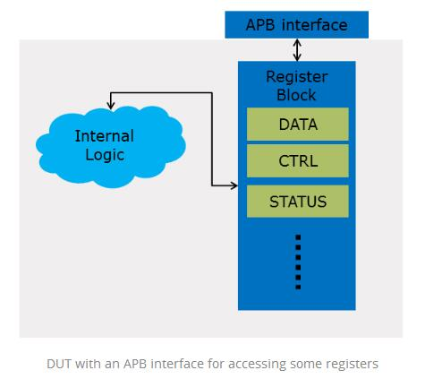
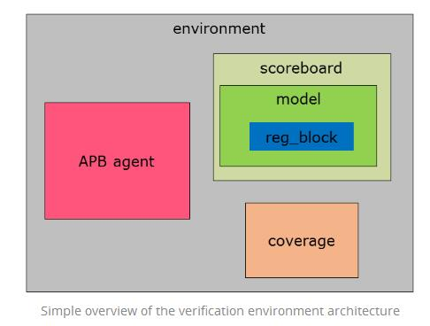
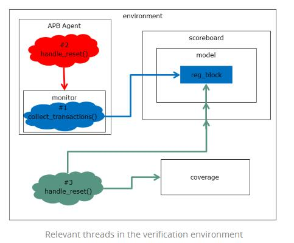
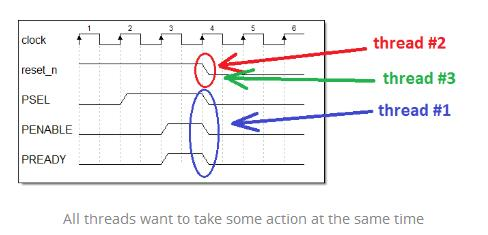

A while back I wrote an [article] about how to handle the reset in an UVM agent component.
Someone asked a [very good question]: **How about handling the reset in the scoreboard?**

In this article I will share with you my way of handling the reset in a verification environment.

Let’s say that we have a DUT with an [APB](http://infocenter.arm.com/help/index.jsp?topic=/com.arm.doc.ihi0024c/index.html) interface for accessing some internal registers.



As with handling reset in an agent, in a full verification environment I try to implement a *handle_reset()* function in each component and all of them should be called in the end from one thread in the environment component.
A simplified version of the environment might look like this:



#### Step #1: Handle the reset in the model

The model component is the most complex component of the environment. It contains the register block, and any other elements and threads used to model the behavior of the DUT. All these elements need to be reset.

```verilog
class cfs_dut_model extends uvm_component;

   //function for handling reset inside the model
   virtual function void handle_reset(string kind = "HARD");
      //kill and restart any ongoing threads

      reg_block.reset(kind);

      //clear here any other elements part of the model class
   endfunction

endclass
```

#### Step #2: Handle the reset in the scoreboard

Handling reset in the scoreboard should first kill and restart any ongoing processes and then reset the model:

```verilog
class cfs_dut_scoreboard extends uvm_component;

   //function for handling reset inside the scoreboard
   virtual function void handle_reset(string kind = "HARD");
      //kill and restart any ongoing threads

      model.reset(kind);

      //clear here any other elements part of the scoreboard class
   endfunction

endclass
```

#### Step #3: Handle the reset in the coverage

Most likely handling reset in the coverage will imply doing some sampling of the internal state of the DUT at reset followed by some cleaning:

```verilog
class cfs_dut_coverage extends uvm_component;

   //function for handling reset inside the coverage
   virtual function void handle_reset(string kind = "HARD");
      //sample the state of the DUT at reset
      //clear here any other elements part of the coverage class
   endfunction

endclass
```

#### Step #4: Handle the reset in the environment

Handling reset in the environment should be similar to the logic which handles reset in an [agent] article1
First we need to have a *handle_reset()* function for doing the actual reset:

```verilog
class cfs_dut_env extends uvm_component;

   //function for handling reset inside the environment
   virtual function void handle_reset(uvm_phase phase, string kind = "HARD");
      coverage.handle_reset(kind);
      scoreboard.handle_reset(kind);
     
      //clear here any other elements part of the environment class
   endfunction

endclass
```

Next, we need a thread which actually waits for the physical reset and call *handle_reset()* function:

```verilog
class cfs_dut_env extends uvm_component;
   virtual task run_phase(uvm_phase phase);
      forever begin
         wait_reset_start();
         handle_reset(phase, "HARD");
         wait_reset_end();
      end
   endtask
endclass
```

In most of the cases this logic will work quite fine but there is a corner case where this logic might break down.

In the logic described above and in [part 1] of this article we can identify several parallel and independent execution threads of the verification environment:



- **thread #1** – APB monitor agent: task for collecting APB transactions. This thread usually affects the register block by updating and checking the registers values.
- **thread #2** – APB agent: task for detecting reset. This thread will affect only the internal logic of the APB agent and one of the actions which will do is to stop thread #1 and restart it. For details see [Step 1](http://cfs-vision.com/2016/04/18/systemverilog-how-to-handle-reset-in-uvm/#step_01) from [part 1](http://cfs-vision.com/2016/04/18/systemverilog-how-to-handle-reset-in-uvm) of this article.
- **thread #3** – Environment: task for detecting reset. This thread will affect the model of the DUT (e.g. reset of the register block), reset the coverage class and so on.

If the reset is asynchronous and never becomes active in the same time with the positive edge of the clock everything is fine but we can not guarantee this.

**The problem is when all threads want to take some action exactly in the same simulation time:**

**reset becomes active on the rising edge of the clock**

**on APB there is an register access**



Because these are parallel threads their execution order is more or less random from the verification engineer point of view.
So if for example the threads are executed in the following order #3 -> #1 -> #2 then:

1. Model will be cleared by thread #3 so this means that the register block will be reset
2. Data will be written in some internal register like CTRL by thread #1 as it collects the APB access
3. Thread #2 will reset the APB agent and restart thread #1 but it will be too late as false data already ended up in our CTRL register model

There is an easy fix for this: **we get rid of the thread for handling reset in the agent (#2) and we handle agent reset from thread #3.**


First, we need to stop the agent from handling the reset on its own:

```verilog
class cfs_dut_env extends uvm_component;
   virtual function void end_of_elaboration_phase(uvm_phase phase);
      apb_agent.agent_config.set_should_handle_reset(0);
      //do the same for any other agent part of the environment
   endtask
endclass
```

Next, we should handle the agent reset from the environment, in the correct order:

```verilog
class cfs_dut_env extends uvm_component;

   //function for handling reset inside the environment
   virtual function void handle_reset(uvm_phase phase, string kind = "HARD");
      apb_agent.handle_reset(phase, kind);
      //do the same for any other agent part of the environment

      coverage.handle_reset(kind);
      scoreboard.handle_reset(kind);

      //clear here any other elements part of the environment class
   endfunction

endclass
```

In this way the verification environment will always be reset correctly because:

- if first it happens thread #3 and then thread #1 – thread #3 will restart thread #1 so no APB transaction will reach the model
- if first it happens thread #1 and then thread #3 – data will be pushed in the register block model by thread #1 but thread #3 will immediately clear it.

The same logic can be applied for any number of agents part of the verification environment.

**The basic idea is this: handle the reset for the entire environment from one single thread so you can control the order in which the components are reset.**