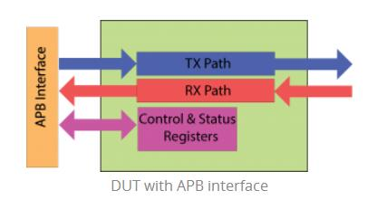
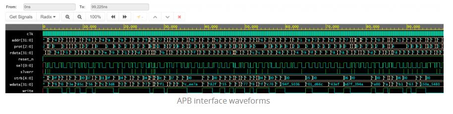
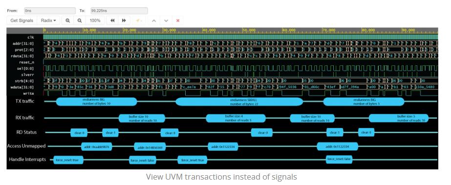
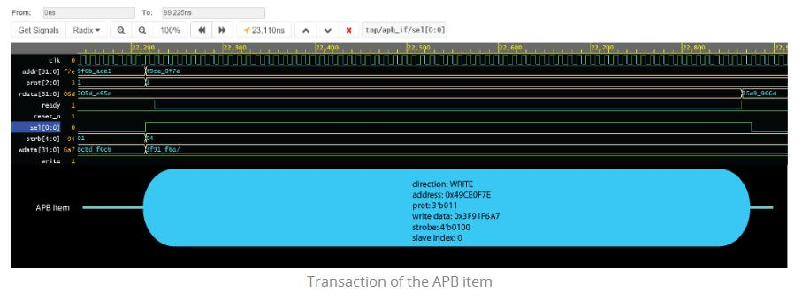
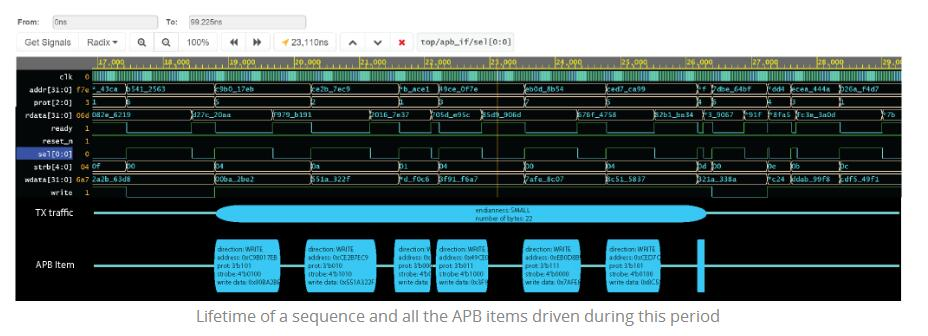
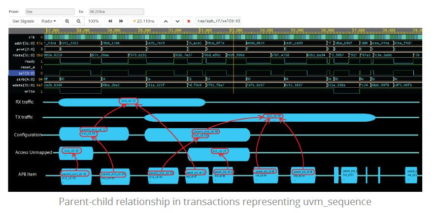
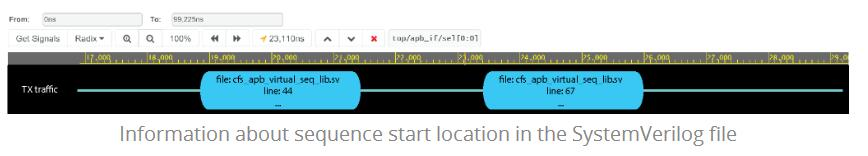

When we say “[debugging](https://en.wikipedia.org/wiki/Debugging)” the first instinct is to associate it with something like a scoreboard or a monitor but quite often a fair amount of time will be spent in debugging the sequences.
The code inside the sequences can easily become huge and complicated. If you have sequences running on multiple threads, fighting for the same interface, it will not be long until you hear a voice inside your head asking “Who the f&%# is driving this on the bus?”

In this post I want to show you how I am handling such scenario.

Let’s say that we have a [DUT](https://en.wikipedia.org/wiki/Device_under_test) with an [APB](https://en.wikipedia.org/wiki/Advanced_Microcontroller_Bus_Architecture#Advanced_Peripheral_Bus_.28APB.29) interface through which we can access some control and status registers, send TX traffic and receive RX traffic.



In my random test I usually think about some sequences (scenarios) which I can run in parallel even if they will try to access the same APB interface. The trick is to find scenarios which do no affect each other.


So my random test will have at least these threads running in parallel:

- configure TX path and start sending data
- configure RX path and start receiving data
- read status registers
- access unmapped locations
- handle interrupts (e.g. clear them)

You can imagine that such parallel threads will create chaos on the APB bus very difficult to debug by looking on the waveforms or even in the logs.



The salvation comes from an UVM feature called transaction. A transaction is actually a class ([uvm_transaction](https://eda-playground.readthedocs.org/en/latest/_static/uvm-1.2/files/base/uvm_transaction-svh.html)) which you can record and view it on the waveforms.
So instead of the chaotic toggling of the APB signals we can now see this:




Let’s see how we can change our UVM SystemVerilog code in order to be able to see these transactions on the waveforms.

# Record The APB Sequence Item

The first step is to the specify what information we want to see in the “bubble” representing one APB sequence item.
There are two ways of doing this: overriding do_record() function or using `uvm_field_* macro. The code below shows an implementation of the first option:

```verilog
class cfs_apb_item_drv extends uvm_sequence_item;
   //direction
   rand cfs_apb_direction direction;

   //address
   rand cfs_apb_address address;
   ...
   virtual function void do_record(uvm_recorder recorder);
      super.do_record(recorder);
      recorder.record_string("direction", direction.name());
      recorder.record_field("address", address, `CFS_APB_MAX_ADDR_WIDTH);
      //add all the relevant fields from the APB item class
      ...
   endfunction
endclass
```

Next we must modify the APB driver code to record the transaction.
We do this using four functions of uvm_transaction: enable_transaction(), record(), begin_tr() and end_tr().

```verilog
class cfs_driver extends uvm_driver#(cfs_apb_item_drv);
   virtual task run_phase(uvm_phase phase);
      forever begin
         cfs_apb_item_drv item;
         seq_item_port.get_next_item(item);

         //the next line enables transaction recording and, in the data browser or
         //of simulator will place a transaction called APB_ITEM under the APB driver
         item.enable_recording($sformatf("%s.APB_ITEM", get_full_name()));

         //the next line will set the begin time of this current transaction
         item.begin_tr($time());
         
         //even if it is not necessary, call record() function here.
         //this will populate the "bubble" with the information specified in do_record()
         //and it will be displayed even if the test ends in the middle of the transaction.
         //This record() function is also called inside end_tr() function
         item.record();

         drive_apb_item(item);
         
         //the next line will set the end time of this current transaction
         item.end_tr($time());

         seq_item_port.item_done();
      end
   endtask;
endclass
```

With these simple modifications of our code we can get rid of the APB signals and replace them with our APB_ITEM transaction.



# Record The Sequences

We take a similar approach for recording the sequences as transactions.
First we specify what kind of information we want to see in the bubble:

```verilog
class cfs_apb_sequence_tx_traffic extends uvm_sequence;
   //endianness
   rand cfs_apb_endianness endianness;

   //number of bytes to send
   rand int unsigned num_of_bytes;
   ...
   virtual function void do_record(uvm_recorder recorder);
      super.do_record(recorder);
      recorder.record_string("endianness", endianness.name());
      recorder.record_field("number of bytes", num_of_bytes, 32);
      //add all the relevant fields from the sequence
      ...
   endfunction
endclass
```

Last thing is to add in the body of the sequence the calls for the uvm_transaction functions:

```verilog
class cfs_apb_sequence_tx_traffic extends uvm_sequence;
   ...
   virtual task body();
      enable_recording($sformatf("%s.TX_TRAFFIC", p_sequencer.get_full_name()));
      begin_tr($time());
      record();

      //do the regular stuff in the sequence body
      ...
     
      end_tr($time());
   endtask
endclass
```

Now you can easily identify on the waveforms the lifetime of a particular sequence.



# Determine Bubble’s Parent-Child Relationship

In most of the cases you will end up with some layered sequences. When viewing all the sequences on the waveforms it is a good thing to know what sequence called other sequences – **parent-child relationship**.
In UVM every [uvm_object](https://eda-playground.readthedocs.org/en/latest/_static/uvm-1.2/files/base/uvm_object-svh.html) created gets an unique number called [inst_id](https://eda-playground.readthedocs.org/en/latest/_static/uvm-1.2/files/base/uvm_object-svh.html#uvm_object.get_inst_id). To easily identify parent-child relationship we can record the ID of the child and the ID of the parent:

```verilog
class cfs_apb_sequence_tx_traffic extends uvm_sequence;
   ...
   virtual function void do_record(uvm_recorder recorder);
      uvm_sequence_base parent = get_parent_sequence();
      super.do_record(recorder);

      if(parent != null) begin
         recorder.record_field("parent_inst_id", parent.get_inst_id(), 32, UVM_DEC);
      end
      recorder.record_field("inst_id", get_inst_id(), 32, UVM_DEC);
   endfunction
endclass
```

We must to a similar thing for the APB sequence item:

```verilog
class cfs_apb_item_drv extends uvm_sequence_item;
   ...
   virtual function void do_record(uvm_recorder recorder);
      uvm_sequence_base parent = get_parent_sequence();
      super.do_record(recorder);
      if(parent != null) begin
         recorder.record_field("parent_inst_id", parent.get_inst_id(), 32, UVM_DEC);
      end
   endfunction
endclass
```

Now it is much easier to see on the waveforms who called who:



**With this little thing we get a quantum leap in debugging efficiency** 

# Extra Tip: Record Where The Sequence Was Started In Your Code

In some cases knowing the child-parent relationship between the sequences is not enough.
For example, one parent sequence can call some sequences multiple times in its body() task.
So it would be very useful to know in what file and at what line number a sequence was started.
We can do this very easily by taking advantage of some UVM macros:

```verilog
class cfs_apb_sequence_tx_traffic extends uvm_sequence;
   //name of the file from which this sequence was called
   protected string file_name;

   //line number inside the file
   protected int unsigned line_number;

   function void set_call_id(string file_name, int unsigned line_number);
       string trim_file_name = file_name;
       this.line_number = line_number;

       for(int i = trim_file_name.len() - 1; i >= 0; i--) begin
          if(trim_file_name[i] == "/") begin
             trim_file_name= trim_file_name.substr(i + 1, trim_file_name.len() - 1);
             break;
          end
       end
       this.file_name = trim_file_name;
   endfunction

   virtual function void do_record(uvm_recorder recorder);
      uvm_sequence_base parent = get_parent_sequence();
      super.do_record(recorder);
      ...
      recorder.record_string("file", file_name);
      recorder.record_field("line", line_number, 32, UVM_DEC);
      ...
   endfunction
endclass
```

Now, wherever we start the sequence we add just one line:

```verilog
seq.set_call_id(`uvm_file, `uvm_line);
seq.start(sequencer);
```

In this way we can see in the waveforms where a particular sequence was started:

