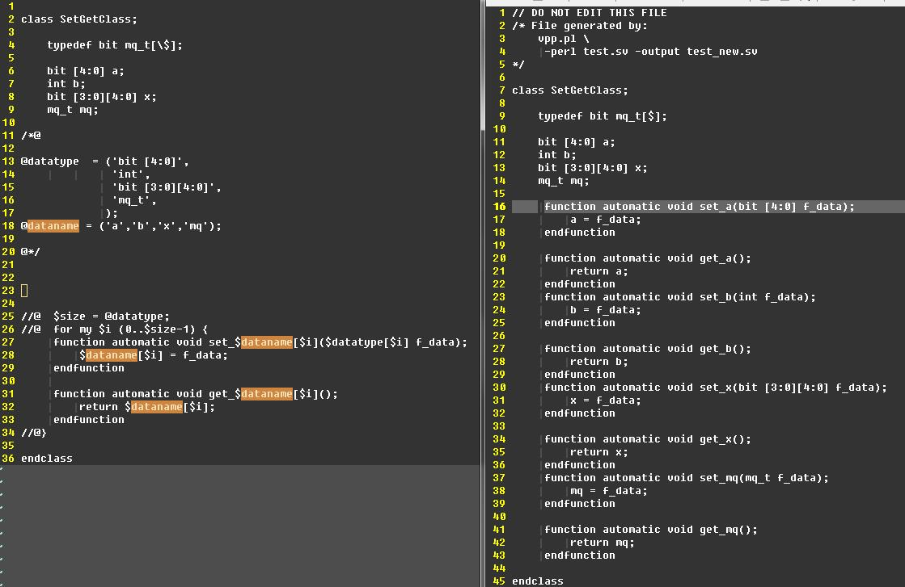

### 可以直接用宏实现，但是必须EDA工具支持<u>6.23 Type operator</u> 

* sv实现~
```verilog
`define uvm_setget_func(T) \
   `m_setter_func(T) \
   `m_getter_func(T) 

`define m_setter_func(T) \
function automatic void set_``T (type(T) t); \
       T = t; \
   endfunction 

`define m_getter_func(T) \
   function automatic type（T） get_``T (); \
       return T;\
   endfunction 

class setget;

    int mtest;

    `uvm_setget_func(mtest)

endclass
```
* 脚本实现~


