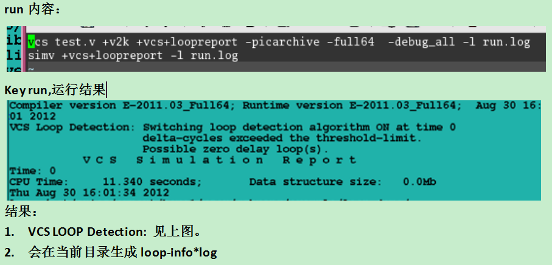
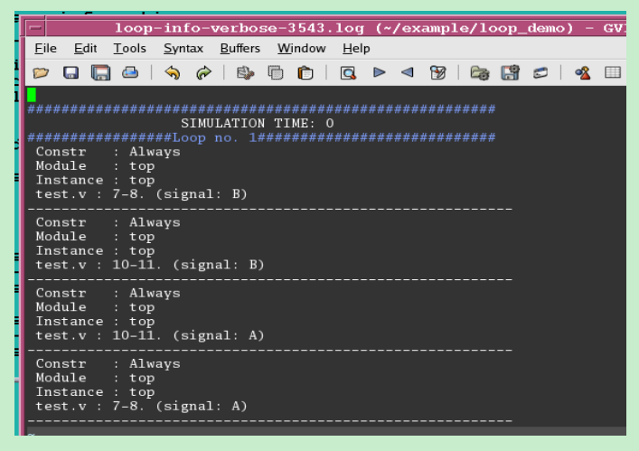
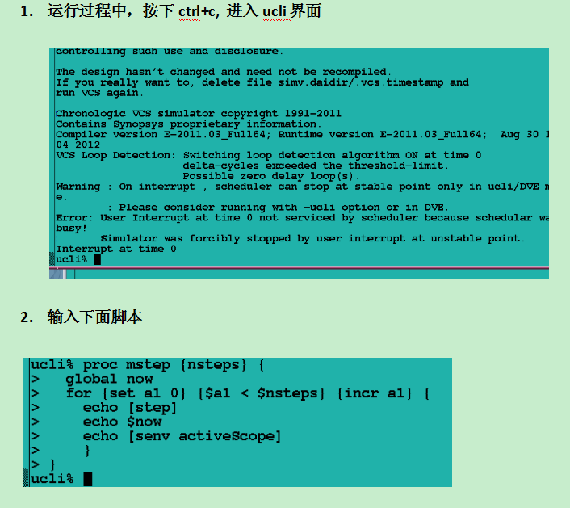
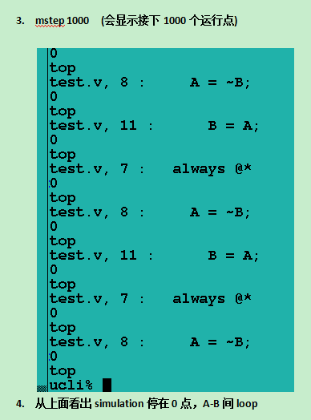

## 1. 什么是infinite loops?
## 2. Infinite loops Example
## 3. 怎样用vcs找到infinite loops
## 4. 实际例子

### 1. 什么是infinite loops?
  
  在xxx项目中，我们整体仿真时碰到了无限循环现象。就是仿真时间不停增加，可是波形文件大小始终不变，整个仿真就停在了某个时间点上。原则上是因为Design中有loop导致。
### 2. Infinite loops Example

Zero delay loops involve feedback chain through update events in scheduler queue
over simulation deltas in a given time-step. Basically, these are the loops
which occur within same simulation time making the events scheduled in same
time-stamp, increasing the delta count, but never advancing the simulation time.

1)  Two (or more) always blocks calling each other (without delay). 
2)  Multiple (delay less) gates with output of one feeding back into the input
to the other in the chain. 
3)  Cont-assigns feeding back into each other or into gates or triggering an
always block that feeds back into cont-assign etc. 
4)  Multiple instances of same/different module(s) feeding back through ports.

1. Combinational loop created with always blocks.
2. Combinational loop created with logic gates (and, or) inside simple modules.
3. Combinational loop created by a latch and few gates.

Example 1: Combinational loop created with always blocks
********************************************************

The below code has 2 always blocks feeding each other, resulting in an infinite loop.

Try it with the command:

```
% vcs +v2k always_loop.v -R
% cat always_loop.v
module top();
  reg A,B;
  initial A =1;
 
  always @*
    A = ~B;

  always @*
    B = A;

endmodule
```


Example 2: Combinational loop created with logic gates (and, or) inside simple modules.
***************************************************************************************

The below example has a chain of logic gates that is eventually a closed chain, without 
any time-consuming delays/events, or any sequential element.  

Try it with the command:

```
% vcs +v2k comb_loop.v -R

% cat comb_loop.v

module tst();
  reg enable;

  initial begin
    enable =0;   // to set loop in defined value
    #10;
    $display ("time=%0t.", $time);
    enable = 1;   // to start infinite loop
    #10;
    $finish;
  end 

  and2 inst1 ( out, enable, fb);
  inv  inst2 ( fb1, out);
  inv  inst3 ( fb2, fb1);
  inv  inst4 ( fb, fb2);

endmodule

module and2 ( out, in1, in2);
  input in1, in2;
  output out;
  assign out = in1  & in2;
endmodule

module inv ( out, in);
  input in;
  output out;
  assign out =  ~ in;
endmodule
```


Example 3: Combinational loop created by a latch and few gates.
***************************************************************

In the below example, it seems as if the latch, being a sequential element, will prevent a combinational loop. 
However, since the latch is open, the logic "self feeding" chain is closed. 

Try it with the command:
```
% vcs -sverilog latch_loop.v -R -ignore driver_checks

% cat latch_loop.v

module top();
  logic A, B, C, clk;

  initial begin
    A   = 1 ; 
    clk = 1 ;
  end

  assign  A =  C;
  assign  C = ~B;

  always_latch 
    if(clk)   B <= A;

endmodule
```

### 3. 怎样用vcs找到infinite loops

+ 两种方法：
 * Compile/simv中加上这个option: +vcs+loopreport+number。
 * 如果1不行，再compile是用-debug_all，然后手动找。

+ 方法如下：
Run the simulation using the following command:
```
 ./simv -ucli
```

+ create the following procedure to run the simulation for "nsteps" 

```
ucli%proc mstep {nsteps} {
  global now
  for {set a1 0} {$a1 < $nsteps} {incr a1} {
    echo [step] 
    echo $now 
    echo [senv activeScope]
    }
}

 Ucli% run 
```

+ Once you think that the simulation is already in infinite loop, you can hit "CTRL C"
```
  Ucli% mstep 1000
```

+ The above step will generate simulation step log for next 1000 steps. You can then analyze the log file to see if there is any repetition of the logic. If you do not see the repetition then run for another 1000 steps and so on.

+ VCS SPEC 中：loop detect说明

**+vcs+loopreport+number
Displays a runtime warning message, terminates the simulation, 
and generates a report when a zero delay loop is detected. By 
default, VCS MX checks if a simulation event loops for more than 
2,000,000 times during the same simulation time. You can change 
this default value by specifying any number along with this option.**

**+vcs+loopdetect+number
Displays a runtime error message and terminates the simulation 
when a zero delay loop is detected. By default, VCS MX checks 
if a simulation event loops for more than 2,000,000 times during 
the same simulation time. You can change this default value by 
specifying any number along with this option.**


### 4. 实际例子

+ 使用方法1



+ 使用方法2



