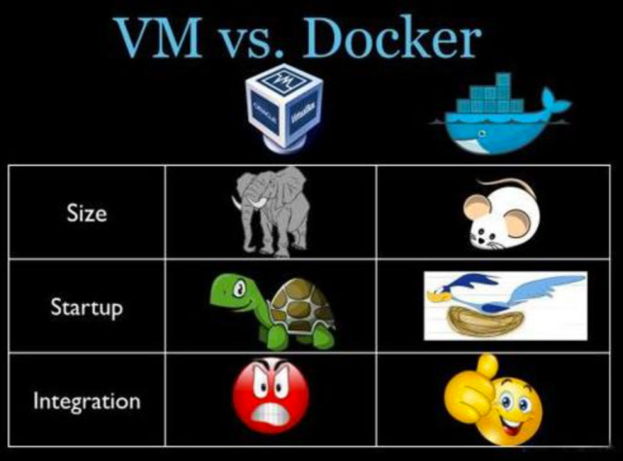
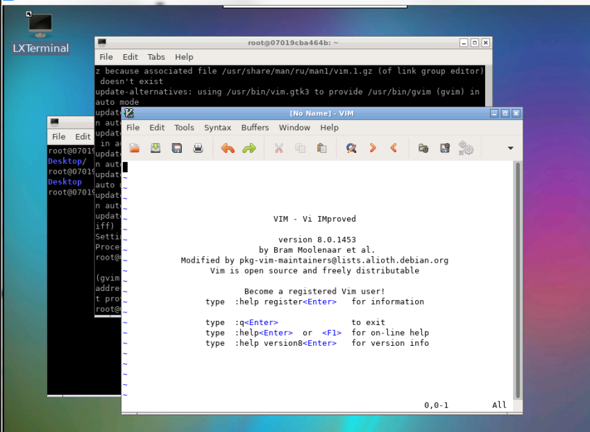

+ VM(VMware)在宿主机器、宿主机器操作系统的基础上创建虚拟层、虚拟化的操作系统、虚拟化的仓库，然后再安装应用；
+ Container(Docker容器)，在宿主机器、宿主机器操作系统上创建Docker引擎，在引擎的基础上再安装应用。那么问题来了，没有操作系统，怎么运行程序？可以在Docker中创建一个ubuntu的镜像文件，这样就能将ubuntu系统集成到Docker中，运行的应用就都是ubuntu的应用。

+ 区别：

+ 神秘人的Docker：

