## 1 (转)

搞IT的小伙伴第一个程序往往是“hello world”，本文照猫画虎，以一个加法器为例揭开cocotb的神秘面纱。

coroutines之async/await 

​    cocotb中testbench的构建是基于python的协程，网上python的资料翻天覆地，绝对比verilog多很多，不做过多介绍，这里简单介绍协程中的关键字async及await：

​    async 用来声明一个函数为异步函数，异步函数的特点是能在函数执行过程中挂起，去执行其他异步函数，等到挂起条件（假设挂起条件是sleep(5)）消失后，也就是5秒到了再回来执行。

​    await 用来用来声明程序挂起，比如异步程序执行到某一步时需要等待的时间很长，就将此挂起，去执行其他的异步程序。await 后面只能跟异步程序或有__await__属性的对象，因为异步程序与一般程序不同。假设有两个异步函数async a，async b，a中的某一步有await，当程序碰到关键字await b()后，异步程序挂起后去执行另一个异步b程序，就是从函数内部跳出去执行其他函数，当挂起条件消失后，不管b是否执行完，要马上从b程序中跳出来，回到原程序执行原来的操作。如果await后面跟的b函数不是异步函数，那么操作就只能等b执行完再返回，无法在b执行的过程中返回。如果要在b执行完才返回，也就不需要用await关键字了，直接调用b函数就行。所以这就需要await后面跟的是异步函数了。在一个异步函数中，可以不止一次挂起，也就是可以用多个await。

DUT—adder 

​    在cocotb的example里的adder example是一个简单的组合逻辑，这里对这个例子稍作改善更改为时序逻辑，RTL源代码如下所示：

```verilog
`timescale 1ns/1psmodule adder #(  parameter integer DATA_WIDTH = 4) 
(  input                                  clk,  
 input  logic unsigned [DATA_WIDTH-1:0] A,  
 input  logic unsigned [DATA_WIDTH-1:0] B,  
 output logic unsigned [DATA_WIDTH:0]   X);  a

lways@(posedge clk )
begin      
    X<=A+B;  
end  
// Dump waves  
initial begin    
    $dumpfile ("adder.vcd");    
    $dumpvars (0,adder); 
endendmodule
```

​    DUT里包含了一个加法器及波形追踪。

TestBench

​    在cocotb里，除了DUT为Verilog之外仿真平台均为Python代码，这里测试代码包含两部分：reference model和tb。

​    reference momodel如下：

```python
def adder_model(a: int, b: int) -> int:  
  """ model of adder """   
  return a + b
```

​    测试代码如下：   

```python
import cocotbfrom cocotb.triggers 
import Timerfrom adder_model 
import adder_modelfrom cocotb.clock 
import Clockfrom cocotb.triggers 
import RisingEdge
import random
@cocotb.test()
async def adder_basic_test(dut):    
    """Test for 5 + 10"""    
    cocotb.fork(Clock(dut.clk, 10, units='ns').start())    
    A = 5    
    B = 10    
    dut.A <= A    
    dut.B <= B    
    await RisingEdge(dut.clk)    
    await RisingEdge(dut.clk)    
    assert dut.X.value == adder_model(A, B), "Adder result is incorrect: {} != 15".format(dut.X.value)
    
@cocotb.test()
async def adder_randomised_test(dut):    
    """Test for adding 2 random numbers multiple times"""    
    cocotb.fork(Clock(dut.clk, 5, units='ns').start())    
    for i in range(10):        
        A = random.randint(0, 15)        
        B = random.randint(0, 15)        
        dut.A <= A        
        dut.B <= B        
        await RisingEdge(dut.clk)        
        await RisingEdge(dut.clk)        
        assert dut.X.value == adder_model(A, B), "Randomised test failed with: {A} + {B} = {X}".format(A=dut.A.value, B=dut.B.value, X=dut.X.value)
```

​    reference model为待测试代码的一个参考模型，而测试代码为整个仿真流程的关键。这里中包含的主要结构为：

- @cocotb.test()：cocotb提供的装饰器，函数前带上@cocotb.test()意味着声明一个testcase。
- 协程函数：由于cocotb是基于协程执行，所有的testcase都是声明为异步函数(async)。
- dut：待测试逻辑，testcase协程函数必须包含的参数(也可以起其他名字，但该参数必须)。
- dut.A<=A：给dut输入接口赋值，这里“<=”并不是HDL中的关键词，但其仿真过程中赋值行为与非阻塞赋值行为相同。若想对信号立即赋值，也可调用sig.setimmediatevalue(new_val)方法进行赋值。
- dut.X.value：访问测试逻辑接口X的值，这里对dut内的任何变量访问都提供了value()方法。
- cocotb.fork()：与systemverilog中的fork行为一致，用于并行执行。
- RisingEdge()：cocotb提供的触发器，检测上升沿。

​    在这个testcase里包含了两个testcase：adder_basic_test及adder_randomised_test，而两个testcase的流程基本一致，分别为：

1. 通过cocotb.fork启动一个时钟。这里两个testcase均包含该语句。一个testcase为一个协程，这里testcase执行完成后协程进入下一个协程需重新驱动时钟。
2. 通过"<="驱动输入信号注入激励。
3. 调用await RisingEdge交出程序执行权限收到clk上升沿后继续执行程序。
4. dut输出结果与reference model进行对比验证。

 makefile

​    在cocotb中，makefile用于执行整个仿真，按照cocotb-Doc中给出的makefile模板：

```makefile
VERILOG_SOURCES = $(PWD)/submodule.sv $(PWD)/my_design.sv
# TOPLEVEL is the name of the toplevel module in your Verilog or VHDL file:
TOPLEVEL=my_design
# MODULE is the name of the Python test file:
MODULE=test_my_design
include $(shell cocotb-config --makefiles)/Makefile.sim
```

​    makefile中需要做的事情是：

- 指定带仿真测试RTL文件代码路径。
- 指定仿真测试DUT顶层。
- 指定Python测试代码文件
- 包含cocotb Makefile.sim启动仿真。

​    这里makefile的设计如下：

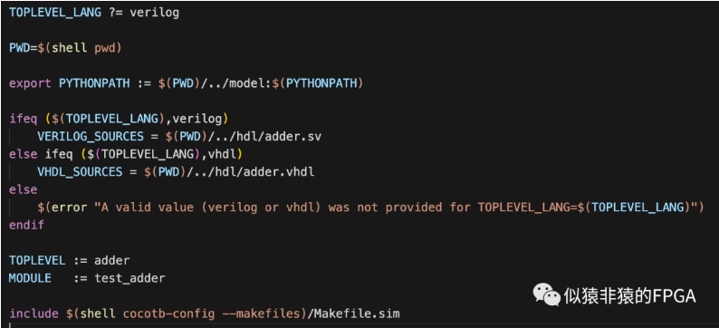

​    在使用makefile时，需要在make时指定仿真器，在vcs环境下，可执行下列指令：

- make SIM=vcs：执行仿真
- make SIM=vcs clean：环境清除，删除中间文件。

 让仿真飞一会儿

​        把仿真跑起来，会看到打印log如下：

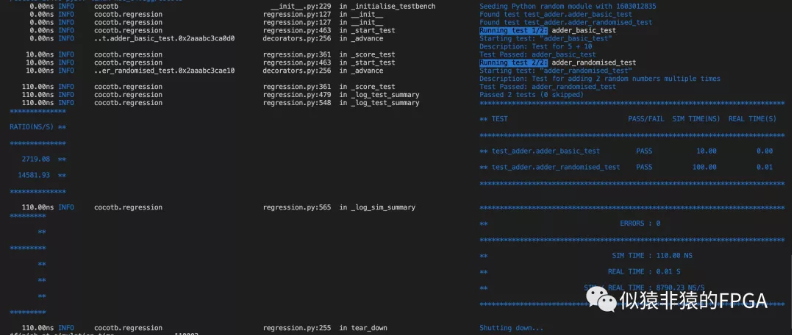

​    会看到仿真启动时检测到有两个testcase，随后会依次执行，最后会打印每个testcase的测试结果是否通过。

 写在最后

​    本文通过一个简单的例子大概梳理了cocotb在仿真时的整体架构组成及书写方式，对cocotb的工作方式有个整体的认知。使用cocotb这套框架进行仿真在仿真的搭建角度依旧需要我们处理接口时序。当然cocotb也有提供了一些接口驱动程序供调用，但cocotb的优势在于case的构建和验证对比上借助Python本身丰富的lib库能够更加便捷的构建。目前python也有基于cocotb的uvm环境和其他lib，感兴趣的小伙伴可以关注下。

## 2 (转)

cocotb的出现使得我们能够在做RTL仿真验证时依托Python来进行测试用例的构建，当我们习惯了用Verilog、SystemVerilog来构建测试用例时，切换到cocotb后最直观的方式便是我们能够建立cocotb中的基础语法与SystemVerilog中仿真常用的关键字又一个对应，能够使我们又一个初步的对照。本篇就cocotb中的基础语法与SystemVerilog中的常用语法做一个对照总结。

**非阻塞赋值**

在使用Systemverilog 进行仿真时，对于接口信号，往往建议采用非阻塞赋值进行操作，其符号为“<=”.

在cocotb中，对于信号的赋值，其提供相应的非阻塞赋值方式，其符号也同样为“<=”。

在cocotb的手册里提到：

The syntax `sig <= new_value` is a short form of `sig.value = new_value`. It not only resembles HDL syntax, but also has the same semantics: writes are not applied immediately, but delayed until the next write cycle.

因而我们可以在cocotb中这样来进行非阻塞赋值：

```python
# Get a reference to the "clk" signal and assign a value
clk = dut.clkclk.value = 1
# Direct assignment through the hierarchy
dut.input_signal <= 12
# Assign a value to a memory deep in the hierarchy
dut.sub_block.memory.array[4] <= 2
```

**阻塞赋值**

针对阻塞赋值(立即生效)，cocotb提供了相应的语法：

setimmediatevalue(value)

因而对于阻塞赋值，我们在cocotb中可以这样写：

```python
dut.input_signal.setimmediatevalue(1)
```

**信号值读取**

对于信号的读取，我们在SystemVerilog中，可以直接读取信号值，而在cocotb中，其为接口变量提供了value方法属性用于获取信号值。

读取方式：sig.value

返回类型:    BinaryValue

Accessing the `value` property of a handle object will return a `BinaryValue` object. Any unresolved bits are preserved and can be accessed using the `binstr` attribute, or a resolved integer value can be accessed using the `integer` attribute.

信号的读取我们可以这么来写：

```python
# Read a value back from the DUT
count = dut.counter.value
print(count.binstr)
1X1010
# Resolve the value to an integer (X or Z treated as 0)
print(count.integer)
42
# Show number of bits in a value
print(count.n_bits)
6
```

**#Time**

在仿真里延迟等待是经常遇到的，在cocotb里，我们通过Timer来实现延迟：

cocotb.triggers.Timer(time_ps, units=None)

Parameters

​    time_ps (numbers.Real or decimal.Decimal) – The time value. Note that despite the name this is not actually in picoseconds but depends on the units argument.

​    units (str or None, optional) – One of None, 'fs', 'ps', 'ns', 'us', 'ms', 'sec'. When no units is given (None) the timestep is determined by the simulator.

由于cocotb是基于协程的，而延迟函数的执行的时间长度是依赖于仿真器的，因此Timer延迟的执行需调用await：

```python
await Timer(1, units='ns')
```

**边沿检测**

在SystemVerilog中我们常用posedge、negedge来检测上升沿和下降沿，在cocotb里，针对边沿检测，其提供了四个调用：

等待调变

class cocotb.triggers.Edge(*args, **kwargs)

Fires on any value change of signal.

等待上升沿

class cocotb.triggers.RisingEdge(*args, **kwargs)

Fires on the rising edge of signal, on a transition from 0 to 1.

等待下降沿

class cocotb.triggers.FallingEdge(*args, **kwargs)

Fires on the falling edge of signal, on a transition from 1 to 0.

检测等待指定到个数边沿

class cocotb.triggers.ClockCycles(signal,num_cycles,rising=True)

Fires after num_cycles transitions of signal from 0 to 1.

Parameters

​    signal – The signal to monitor.

​    num_cycles (int) – The number of cycles to count.

​    rising (bool, optional) – If True, the default, count rising edges. Otherwise, count falling edges.

​    我们在使用时，可以这么来写：

```python
#等待信号signalA发生变化
await cocotb.triggers.Edge(dut.signalA)
#等待signalA从0变为1
await cocotb.triggers.RisingEdge(dut.signalA)
#等待signalA从1变为0
await cocotb.triggers.FallingEdge(dut.signalA)
#等待signalA从0变为1三次
await cocotb.triggers.ClockCycles(dut.signalA,3,true)
```

**fork-join_none**

SystemVerilog中的fork-join_none用于发起一个线程但不等待线程的结束，在cocotb中，相应的语法为fork：

cocotb.fork()

Schedule a coroutine to be run concurrently

 在写仿真代码时，我们可以这么写：

```python
async def reset_dut(reset_n, duration_ns):    
    reset_n <= 0    
    await Timer(duration_ns, units='ns')    
    reset_n <= 1    
    reset_n._log.debug("Reset complete")
reset_thread = cocotb.fork(reset_dut(reset_n, duration_ns=500))
```

这里值得注意的是，由于fork是起一个协程，因而resut_dut需添加async声明。

**fork-join**

与SystemVerilog中相对应的，cocotb等待一个协程的结束同样提供了join方法：

class cocotb.triggers.Join(*args, **kwargs)

Fires when a fork()ed coroutine completes.

The result of blocking on the trigger can be used to get the coroutine result:

使用方式：

```python
async def coro_inner():    
    await Timer(1, units='ns')    
    return "Hello world"
task = cocotb.fork(coro_inner())
result = await Join(task)
assert result == "Hello world"
```

**fork-any**

相较于SystemVerilog中的join-any语法，cocotb并无专门的对应语法，但却有相似的方法供调用：

class cocotb.triggers.First(*triggers)

等待第一个协程结束即返回

```python
t1 = Timer(10, units='ps')
t2 = Timer(11, units='ps')
t_ret = await First(t1, t2)
```

 这里我们通过First等待t1、t2第一个返回的结果后await结束，并将第一个返回的协程的返回结果赋值给t_ret。

**event**

对于SystemVerilog中的event，在cocotb中同样提供类似的event：

class cocotb.triggers.Event(name=None)

​    用于两个协程间的同步

​    方法：

​    set(data=None)：唤醒所有等待该事件的协程

​    wait()：                  等待事件的出发(await),如果事件已经触发，立即返回

​    clear()：                清除以触发的事件

​    is_set()：                判断事件是否触发        

**旗语**

cocotb中提供了Lock操作用来实现与SystemVerilog中相似的操作，不过Lock不可声明旗语为多个：

class cocotb.triggers.Lock(name=None)

​    方法：

​    locked ：     True if the lock is held.

​    acquire() ：Produce a trigger which fires when the lock is acquired.

​    release()：  Release the lock.

**mailbox**

SystemVerilog中的mailbox主要用于不同进程间的通信，在cocotb中，普通的Python的队列即可实现该功能(协程中无需没有进程间同步问题)。

## 3 (转)

上篇梳理了在SystemVerilog中编写testBench中的常用语法与在cocotb中对应的语法，本篇在不调用cocotb中的任何仿真库的基础上编写第一个testBench。

这里我们用一个带输入有效标志的加法器作为最基本的设计模块来作为DUT：

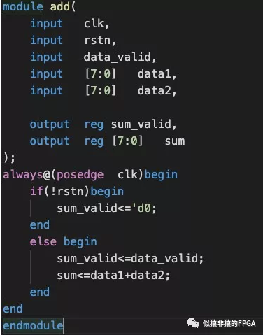

**测试环境搭建**

​    这里我们的测试平台采用如下框架进行搭建：

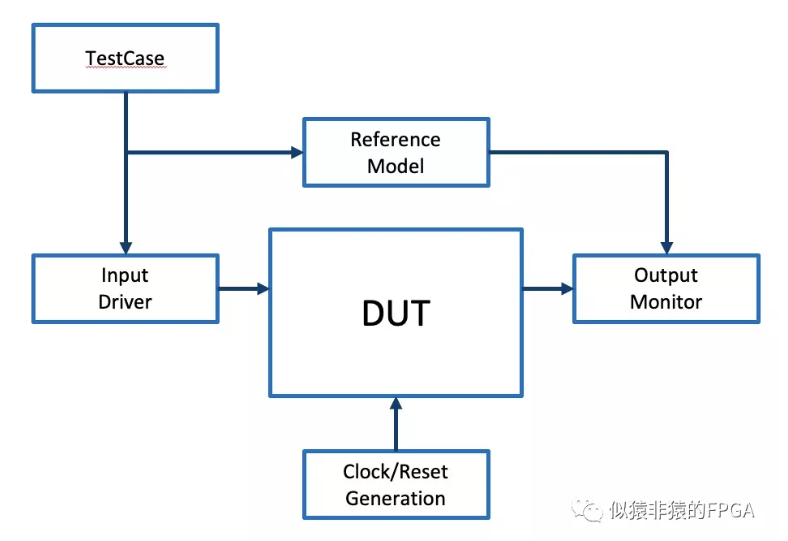

**时钟与复位信号生成**

​    时钟与复位信号的产生我们放在一个ClockDomain的类中：

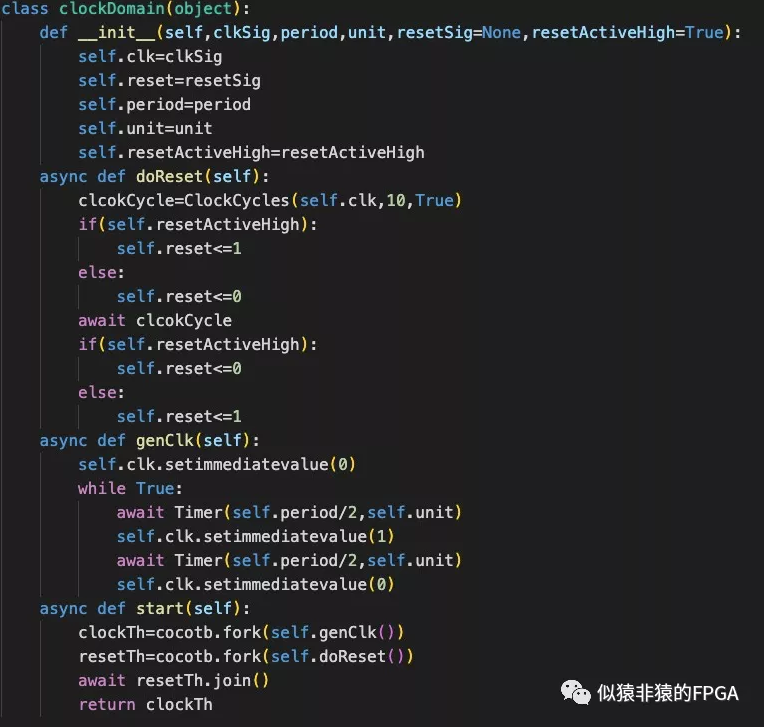

​    我们在这里定义的clockDomain类中的初始化函数__init__包含的参数列表为：

- clkSig：时钟信号。
- period：时钟周期。
- unit：事件单位(timeuint)。
- resetSig:复位信号。
- resetActiveHigh:指明复位信号为高电平有效还是低电平有效。

​    在doReset()函数中，我们为函数添加async声明为一个协程，这里指定复位信号复位十个时钟周期后解复位。

​        cocotb基于协程方式运行，我们跨周期的驱动接口信号需将函数声明为协程，添加async声明。


​    同样的genClk函数我们用于产生时钟信号，也添加async声明。这里根据指定的时钟周期驱动生成时钟信号。

​    start()函数用于触发生成复位和时钟，这里通过cocotb.fork函数调用doRest及genClk分别产生时钟与复位信号。

**inputDrv**

​    在input driver中我们针对DUT的输入端口进行封装：

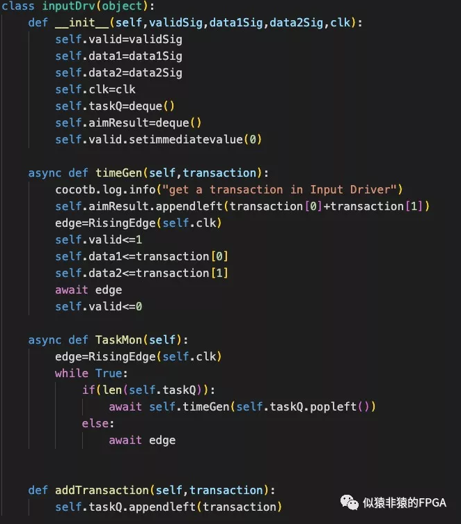

​    这里的初始化函数里的传入参数为：

- validSig：输入有效信号。
- data1Sig:  data1输入信号。
- data2Sig：data2输入信号。
- clk：输入信号所属时钟信号。

​    同时，我们在初始化函数里新增定义了下面的变量：

- taskQ：待处理任务的缓存队列，用于接受testcase传入的带测试数据
- aimResult：期望结果存放队列，用于缓存reference model输出结果

​    在__init__函数中，我们也将valid信号赋值为低电平。

​    taskMon函数为任务监听函数。这里每个时钟上升沿检测tasjQ是否有待处理任务，若有则调用timeGen函数生成输入接口时序。

​    timeGen函数为接口驱动函数，根据透穿的transaction将数据激励驱动到接口列表里，同时计算期望结果存入aimResult中。

​    addTransaction函数用于testcase向taskQ中压入待测试激励数据。

**outputMon**

​    outputMon则用于监控DUT输出接口：

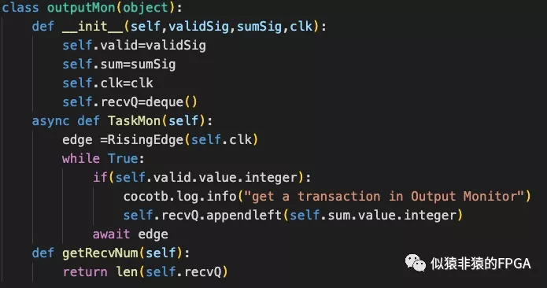

​    这里我们在初始化函数参数列表里透传了DUT输出接口validSig、sumSig及时钟信号。同时在__init__函数中生命了recvQ用于存储监控到的DUT输出结果。

​    TaskMon函数则用于监控DUT输出接口时序，当检测到valid输出为高时将sumSig结果存入recvQ中。

​    getRecvNum函数则用于计算当前recvQ中收到多少个数据输出。

**adderTb**

​    有了上述基础组件，我们可以搭建整体的测试平台adderTb：

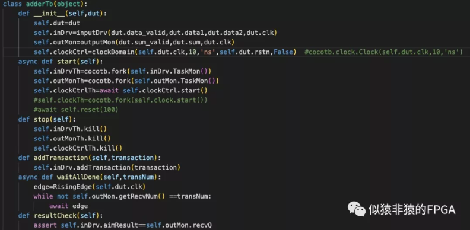

​    在adderTb的初始化函数里，我们透传了带测试单元dut作为参数。而在初始化函数里，我们例化了inputDrv、outputMon、clockDomain。

​    在start函数中，通过调用cocotb.fork创建了inDrvTh、outMonTh、cloclCtrlTh三个协程。

​    而stop函数用于终止仿真，我们通过调用协程的kill函数终止创建的协程。

​    addTransaction函数用于向inDrv注入激励。

​    waitAllDone函数则用于等待outMon中recvQ中收到了期望的输出结果个数。

​    resultCheck函数则用于对比输出结果与期望结果。

​        在整个testBench中，凡是包含与DUT打交道需将执行权限交给仿真器的函数均添加了async声明为协程。

**test case**

​    这里我们建立一个名为run_test的test case：

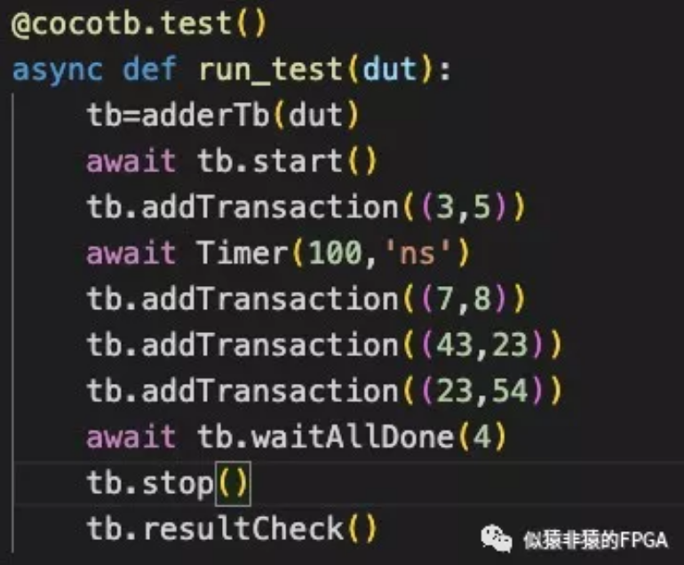

​        在cocotb中，testcase均需添加@cocotb.test()修饰，同时参数列表里传入待测试单元dut。cocotb在运行时以此检测testcase并与待测试单元进行关联。

​    至此，我们基于cocotb搭建的整个testBench完成，可进行仿真验证。

**仿真结果**

​    运行仿真，我们得到的打印输出为：

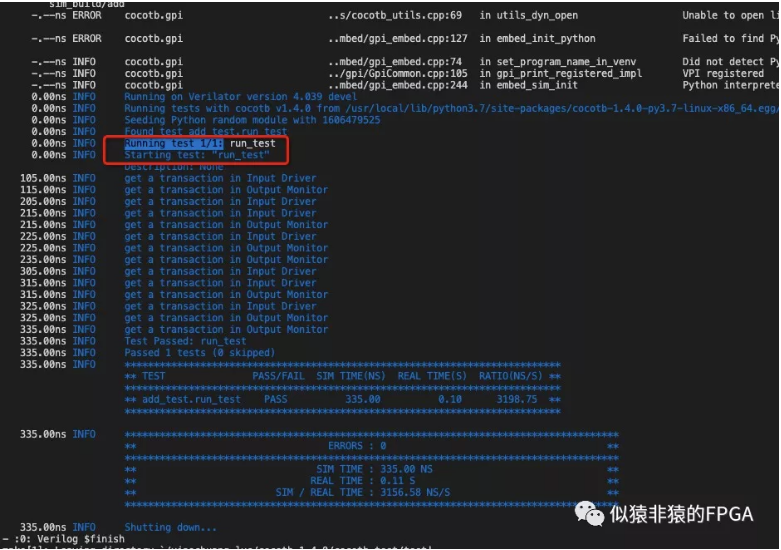

​    可以看到，cocotb运行检测到一个testcase，并且测试通过。

​    仿真波形如下：

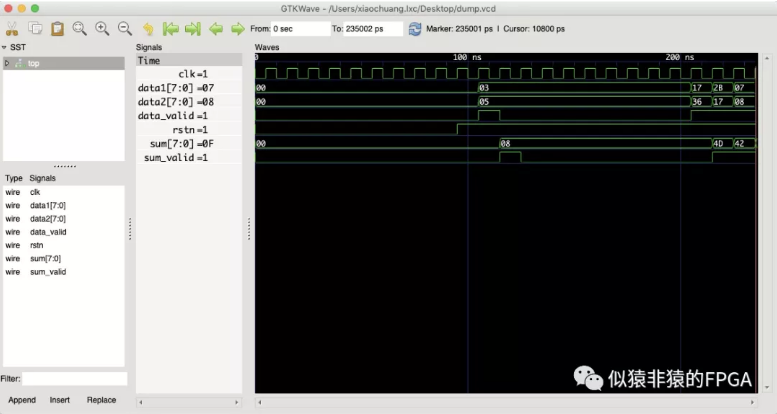


## 4 (转)

 最近又重新用到cocotb去仿真一些FPGA IP，续接之前内容，后续也会陆续在相关方面做一个更新。

》BinaryValue

​     在cocotb中无论是对于对于dut的输入赋值还是对输出信号的读取，其总离不开BinaryValue的身影。

​    导入路径：

```
from cocotb.binary import *
```

》初始化函数

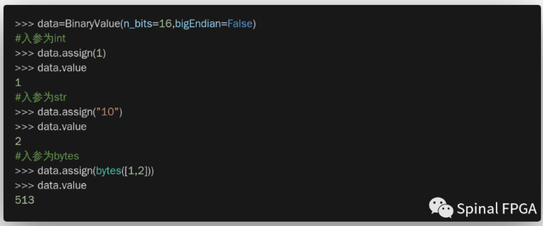

​    参数列表：

- value：信号值，数据类型可以是str、int、bytes。
- n_bits：指定信号位宽
- bigEndian：制定是否为大尾端。
- binaryRepresentation：用于指定数据类型，支持下面三种格式：

```python
class BinaryRepresentation:  # noqa    
    UNSIGNED         = 0  #: Unsigned format    
    SIGNED_MAGNITUDE = 1  #: Sign and magnitude format    
    TWOS_COMPLEMENT  = 2  #: Two's complement format
```

》数据赋值

​    BinaryValue数据的赋值可以通过assign方法实现。__init__中也是调用了该方法。

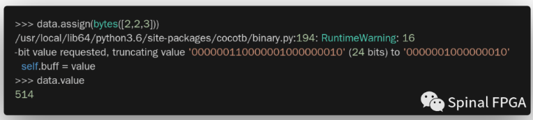

​    值得注意的是，当复制数据超过n_bits所能表达的值时，BinaryValue将会进行截取(SpinalHDL里则是会进行报错)。

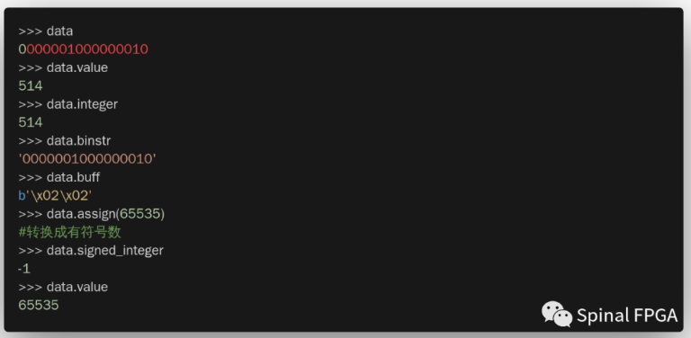

​    可以看到赋值的高位被截断，仅保留低16bits。

》数据读取

​    数据的读取可以通过以下方式进行：

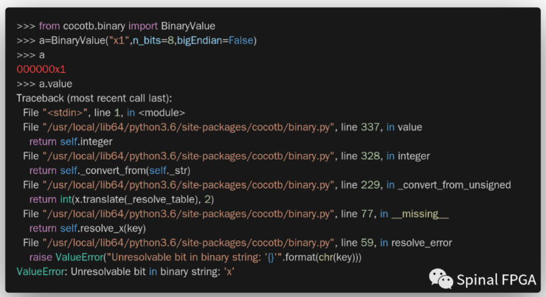

​    BinaryValue内部也构建了一系列其他常用方法，如__ne__,__sub__等，感兴趣的可以去源文件中翻看。

》不定态X

​    在cocotb1.4.0之后，对于不定态默认按照错误处理，如下所示：

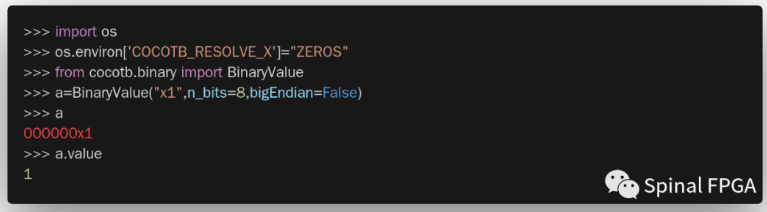

​    可以通过声明环境变量COCOTB_RESOLVE_X来处理不定态X。可以设定为ZERO，ONES，RANDOM。

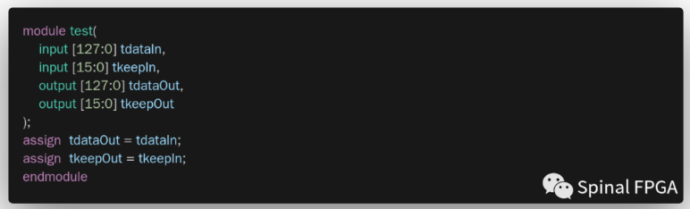


》关于大小尾端的问题

​    BinaryValue默认采用大尾端模式，对于dut信号的读取，故而也采用大尾端模式。考虑下面的DUT和testbench：

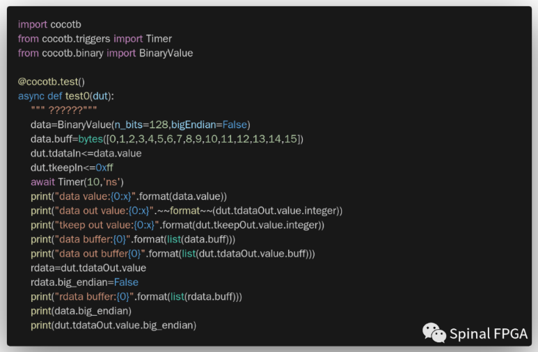

​    testbench:

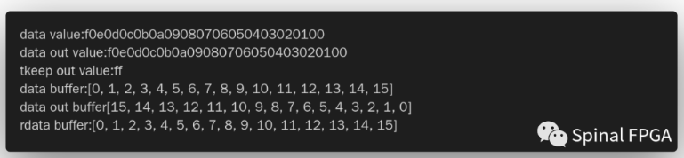

​        其输出结果为：


​    可以看到，大小尾端的体现在于buff数据的存储方式，可以通过设置big_endian来更改大小端模式（通常小尾端居多）。

》数据转换

​    通常数据以字节为单位进行存储，而在dut接口上往往数据位宽较大。在SpinalHDL中的转换可以参照[《几个仿真时数据激励生成方法》](http://mp.weixin.qq.com/s?__biz=Mzg5NjQyMzQwMQ==&mid=2247490697&idx=1&sn=118fc4a8d2585af0927b57edba0d022f&chksm=c000180ff777911932445199aca98fb13801c967a48fbe2de72faa3481fb40d0d5f1308ca83c&scene=21#wechat_redirect),而在cocotb中，可以参照下面的方式进行：

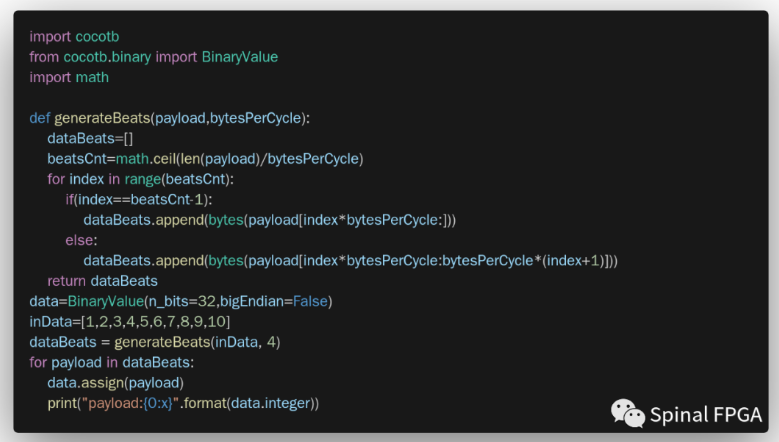

​    执行结果如下：

```
payload:4030201
payload:8070605
payload:a09
```

## 5 (转)

 在cocotb仿真里，经常出现三个组件：Driver、Monitor、Scoreboard。今天先看看Driver、Monitor中最里面的Bus的实现。

* Bus

​    cocotb中提供了Bus 类用于抽象归纳设计中的总线(诸如Axi4、AHB等) ，其初始化函数为：

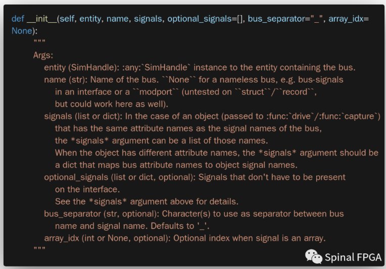

​    bus中的信号分为两组：signals和optional_signals。signals为总线中必须存在的信号，而optional_signals则为不一定要求存在的信号(诸如Axi4中的cache、lock等信号不是要求必须使用的)。此外bus中信号的名称为遵循如下规则：

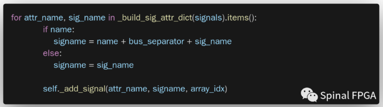

​    举个例子：

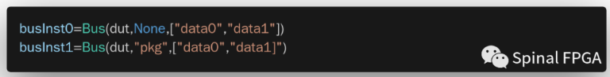

​    busInst0对应的dut中的信号data0，data1，而busInst1则对应dut中的信号pkg_data0,pkg_data1。

​    Bus中提供的方法主要有下面三个：

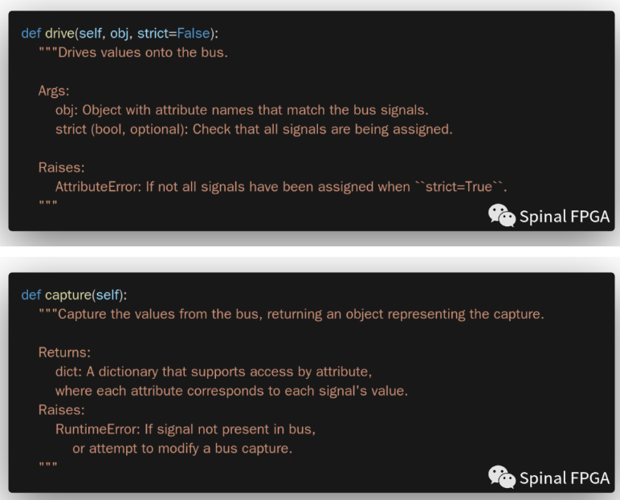

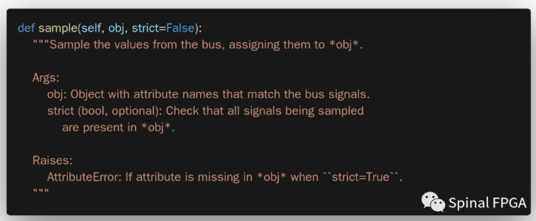

​    注释都看得懂，但似乎又很抽象是不是？而手册上又没有什么例子。别急，这里给出一个三个函数的用法           

* DUT

​    这里采用一个简单的dut：

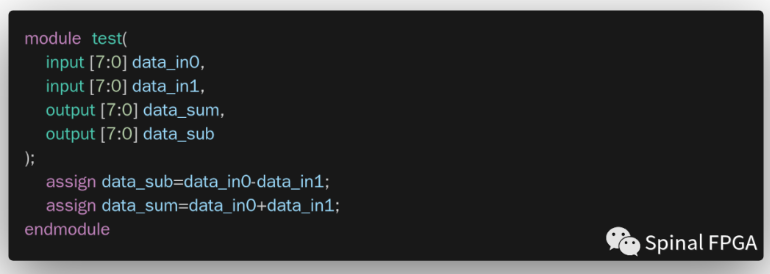

* drive

​    drive函数的使用如下所示：

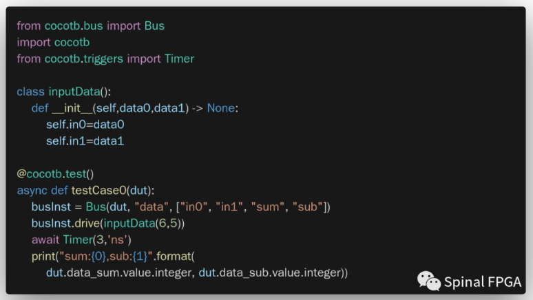
​    drive函数使用关键在于obj参数的输入。drive函数可以封装整个总线的赋值行为。这里我们定义一个inputData类，在类里包含了bus总线对应的in0、in1信号变量。在drive中是按照变量名进行索引的，inputData中的in0的值将会对应赋值给bus中的in0，故而需要一一对应。仿真激励波形如下所示：
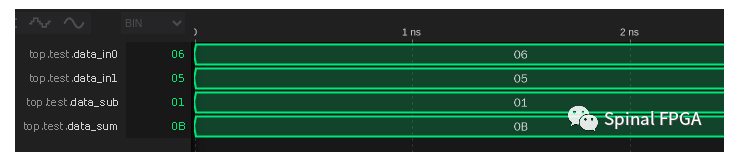

​    可见，data_in0被赋值为6，而data_in1被赋值为5，与inputData中的信号赋值情况相同。

​    对于drive中的strict信号，当其为False时，仅会驱动obj中所包含的信号。

* sample

​    sample用于信号的采样，其使用方式如下所示：

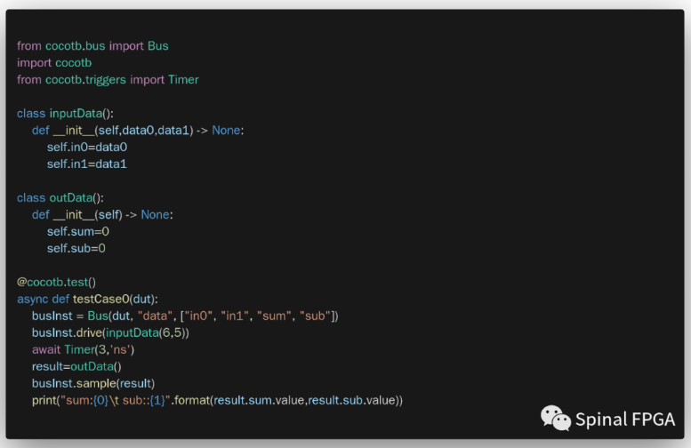

​    与dirver类似，这里新增定义了一个outData类，其中包含两个变量sum、sub，与busnst中的信号名称保持一致。仿真输出：

```
sum:11   sub::1
```

* capture

​    capture使用较为简单，其返回一个dict，其中包含了bus所包含的所有信号及其对应的值。使用方式如下：

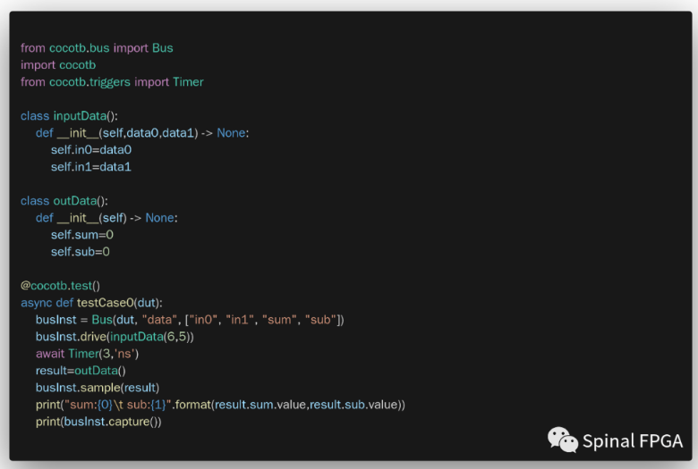

​    打印结果：

```
sum:11   sub:1{'in0': 00000110, 'in1': 00000101, 'sum': 00001011, 'sub': 00000001}
```

* <=

​    除了上面的这些方法之外，还有一个隐藏的方法“<=”。正如单个信号的赋值驱动之外，总线也可以用“<=”进行赋值驱动。如下例所示：

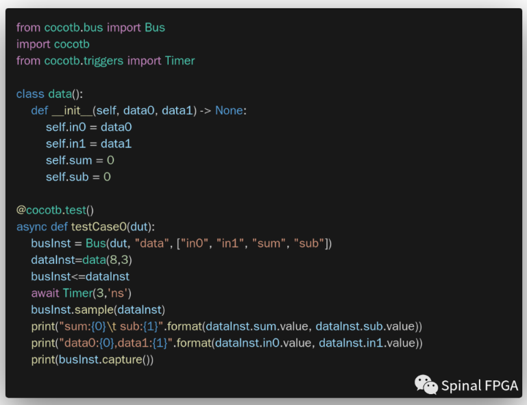

​    这里定义了一个data类，在激励输入的时候直接使用<=进行赋值驱动，仿真结果无误：

```bash
sum:11   sub:5data0:8,data1:3
```

