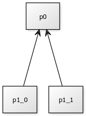

(转)

# Bigger Is Not Always Better: Builds Are Faster with Smaller Packages

One trend over the past few years is that the projects I've been working on tend to get bigger and more complicated. Bigger projects come with new challenges. Among these are the fact that it's much more difficult to keep the entire project in one's head, the need to synchronize with more developers because team sizes grow, a higher risk of having to re-write code because of poorly understood requirements or because some requirements change, and many more.

There's one thing, though, that crept up on me: compile times get much bigger. While this doesn't sound like a big deal, I've found that long build times are an absolute drain on productivity. I use [SVUnit](http://agilesoc.com/open-source-projects/svunit/) a lot, so I'm used to having a very short path between making a change and seeing the effects of that change. Ideally, there should be no delay between starting the test script and getting the result. A delay of a couple of seconds is tolerable. More than 10 seconds becomes noticeable. After exceeding the one minute mark, the temptation to switch to something else (like the Internet browser) becomes very high. This slowdown happens gradually, with each new class that is added, decreasing development speed.

In this post I'd like to talk about compilation. This topic has a tendency to be trivialized and underestimated, even more so in the hardware industry, where it's common to have design flows already set up to deal with this process.

## Full vs. incremental builds

A build is the process of taking the source code and producing an executable object. When talking about builds, there are two terms we need to be familiar with: full builds and incremental builds. A full build is performed when there isn't any build output, which requires the entire source code to be built. This is either the case when starting in a new workspace (for example, after cloning the source repository) or after deleting the previous build output. An incremental build only builds the parts of the source code that have changed since the previous build. Because only parts of the project are rebuilt in this case, this means that, generally, the process is faster.

We'll limit our discussion about builds to SystemVerilog packages, though the same concepts also apply to modules and interfaces.

Let's say we have two packages, *package0* and *package1*, which we use in our verification environment:

```verilog
// File: package0.sv

package package0;

  class some_base_class;
  endclass

endpackage
```

```verilog
// File: package1.sv

package package1;

  import package0::*;

  class some_derived_class extends some_base_class;
  endclass

endpackage
```

Compiling these two packages using an EDA tool is pretty straightforward:

```shell
compiler package0.sv package1.sv
```

The very first time we run this command, the tool will parse the two source files and generate the data structures it uses to represent the compiler output. Since we didn't have any build output when we ran the command, we were performing a full build.

If we add a new class to *package1* and run the compiler again, we will be performing an incremental build:

```verilog
package package1;

  import package0::*;

  class some_derived_class extends some_base_class;
  endclass

  class some_other_class;
  endclass

endpackage
```

The tool will only recompile *package1*. It won't touch *package0*, since it didn't change. If compilation for *package0* takes a lot of time, this will saves us that time.

## A deeper dive into SystemVerilog compilation

Before we continue with our main discussion, it makes sense to look a bit deeper into how SystemVerilog compilation works. Before I investigated this topic I had some misplaced ideas, which I would like to dispel.

I have only ever really looked at the behavior of one particular EDA tool, but I assume that other simulators behave similarly, as they all have a common heritage. Some SystemVerilog tools differentiate between compilation and elaboration. These defintions depend on the tool you're using. I've seen compilation used to mean parsing the code and generating syntax trees. Elaboration takes these syntax trees and generates executable code that is run in the simulator. I'll use the term *compile* to mean both of these steps.

Let's start small, with a single package that contains only one class:

```verilog
package package0;

  class some_base_class;
  endclass

endpackage
```

After we compile the package, we will have performed a full build. Now, let's add another class to the package:

```verilog
package package0;

  class some_base_class;
  endclass

  class some_base_class2;
  endclass

endpackage
```

In this case, you'll notice that the tool compiles both classes. I'm a bit cautious about posting the log files and how I can tell that it's compiling both classes. Some tools make this easier to see than others. One clear sign is that compile takes longer. You can try it out by adding more and more classes and recompiling. 

In this case, an incremental compile takes about as much time as a full build, which suggests that nothing is being reused from previous build attempts. Even if we only add classes, the build output for previously built classes is discarded.

What did we learn from this? That tools only organize build output using packages as their most granular unit. Changes within packages are "lost", from an incremental build point of view.

You could argue that from the previous experiment we could infer that tools organize build output based on files. If we were to put each file in its own class and include them in the package, then the tool would be able to somehow behave differently. This isn't, the case, though. *`include* directives are handled by the pre-processor. It interleaves all of the files together and gives the compiler a big file with all the class definitions inline (the situation we had previously).

We can do another experiment to convince ourselves that builds aren't organized by files. Let's put two packages inside the same file:

```verilog
package package0;
endpackage

package package1;
endpackage
```

Let's modify *package1* by adding a new variable:

```verilog
package package0;
endpackage

package package1;
  bit some_var;
endpackage
```

When rebuilding, we'll notice that only *package1* gets rebuilt, but *package0* is left alone. (This is also the behavior we would have liked to have for classes inside a package.)

Now let's also modify *package0* by adding a variable to it:

```verilog
package package0;
  bit some_var;
endpackage

package package1;
  bit some_var;
endpackage
```

When rebuilding, we'll see that *package0* is being rebuilt, as we expected, but, surprisingly, so is *package1*. This is very confusing initially, but obvious once you know the explanation. Because we shifted the lines where *package1* and its items are defined in the file, the tool has to update debug information regarding line numbers. This is important for debuggers and for messages that contain line numbers (like assertion erros, *$info(...)* calls, etc.). This, by the way, is a very good reason to only define one element (package, interface, module) per file.

Let's look at one more thing. Let's take two packages that have a dependency relationship:

```verilog
package package0;

  class some_base_class;
  endclass

endpackage
```

```verilog
package package1;

  import package0::*;

  class some_derived_class extends some_base_class;
  endclass

endpackage
```

It's clear that changes to *package1* shouldn't (and indeed won't) cause rebuilds of *package0*. It's also clear that changing *some_base_class* will have to trigger a rebuild of *package1*. Now, let's add a new class to *package0*:

```verilog
package package0;

  class some_base_class;
  endclass

  class some_base_class2;
  endclass

endpackage
```

At this point, we shouldn't be surprised anymore that both packages are rebuilt in this case. This is because the tool only understands changes at the package level. *package1* depends on *package0*, so any change to *package0* will lead to a rebuild of *package1*, regardless if this is really needed. Unfortunately, this isn't the behavior we would like to have.

Contrast the way SystemVerilog builds work to C++, where files are compiled individually and are linked together in a separate step (a gross over-simplifaction). Changes to one class don't cause recompiles of other classes in the same namespace, if the two classes are unrelated. This is because C++ classes are split between the header (which declares which functions a class provides) and the implementation (which contain the function bodies). A class that depends on another class includes its header, to let the compiler know that it relies on the other class. Only changes in a class's header cause recompiles of dependent classes, while changes to its implementation don't. Because of this setup, C++ builds are much more powerful when it comes to build avoidance, by only rebuilding the parts that they absolutely have to build. This allows for guidelines that incremental builds should take between 5-10 seconds and that full builds (including tests) should take between 1-2 minutes, according to <http://www.bitsnbites.eu/faster-c-builds/>, numbers which are incredibly low by SystemVerilog standards, where merely starting the simulator takes double digit numbers of seconds.

## Case study

The classic testbench structure for an IP block consists of one or more interface verification components (IVCs), that contain code related to the signal protocols used by the design, and one module verification component (MVC), that contains code for aspects related to the design functionality.

IVCs typically consist of a package and one or more interfaces. We don't usually make changes to the IVCs, so once we've built them via a full build, they won't have any impact on subsequent incremental builds.

Most of our work is focused on the MVC. As we've seen above, if we place our MVC code into one package, then any change we make to it will trigger a new build, because of the way SystemVerilog tools handle incremental builds. This isn't going to be very efficient, as an incremental build of the package after each change will take about as long as a full build.

What would happen if we could split our big MVC package into multiple smaller packages?

It's experiment time again! We'll assume that we can split the code such that building each package takes the same amount of time. We'll also ignore any extra costs from building multiple packages instead of one single package. This means that if an incremental build of the entire *mvc* package would have taken *N* seconds, then by splitting it into *P* packages each of the smaller packages would take *N/P* seconds to build. We'll also assume that we are just as likely to make changes to any of the smaller packages. This means that the probablity to change any package is *1/P*.

Let's assume that we can create two independent packages, *p0* and *p1*. We can misuse UML to visualize the package topology:

Any change we make to *p0* won't cause rebuilds of *p1* and vice-versa. We can compute the average incremental build time in this case. Building any of the packages takes *N/2* seconds, but we do it only half of the time (since in the other half we change the other package). The average incremental build time is the mean: *N/2 \* 1/2 + N/2 * 1/2 = N/2*. By splitting the code into two independent packages, we've managed to half our incremental build time. It's not very realistic, though, that we could manage to do such a split on a real project.

Let's have a look at something closer to reality. Let's assume that we can split our MVC into two packages, *p0* and *p1*, but *p1* depends on *p0*:

An incremental build of *p1* would still take only *N/2* seconds, because changing anything in *p1* doesn't have any effect on *p0*. A change in *p0* would mean that we also have to rebuild *p1*, which means that it would take *N/2 + N/2 = N* seconds. On average, we would need *N/2 \* 1/2 + N * 1/2 = 3/4 * N* seconds.

We should try to structure our code in such a way as to increase the number of packages without any dependencies to each other. Let's say we can split *p1* from the previous example into two independent packages, *p1_0* and *p1_1*:

In this case, changing anything in either *p1_0* or *p1_1* would take *N/3* seconds. A change in *p0* would require all three packages to be rebuilt and would take the full *N* seconds. On average, a change would take *N/3 \* 1/3 + N/3 * 1/3 + N * 1/3 = 7/9 * N* seconds.

We could go on further with deeper package hierarchies, but I think you get the idea.

MVC code lends itself nicely to such a structure. We typically have some "common" code that models the basics of our DUT, from which we can model different higher level aspects, relating to the features of the DUT. We would use our models inside checks or coverage, which could be built independently from each other:

## Conclusions

Splitting code across multiple packages will generally be better for compilation speed. There are also other advantages. It could make the code base easier to understand, by grouping code by theme (code for *X* goes in package *p_x*, code for *Y* goes in package *p_y*). It could also make development easier, by allowing developers to specialize in only a handful of the packages, instead of having to deal with the entire code base.

Having to manage multiple packages brings its own set of challenges, though. It could make the code base more difficult to understand if the boundaries between packages are arbitrary (where does code for *X* go, in *p0* or *p1*?). More packages, especially when they have intricate dependency relationships, also make compilation more difficult to set up.

I'm not going to recommend making one package per class, just to improve build times. Ideally, SystemVerilog compilers should evolve to better handle incremental compilation, by working at levels lower than just packages. At the same time, you should care about turnaround time, so dumping all code into one package shouldn't be your default mode of operation.