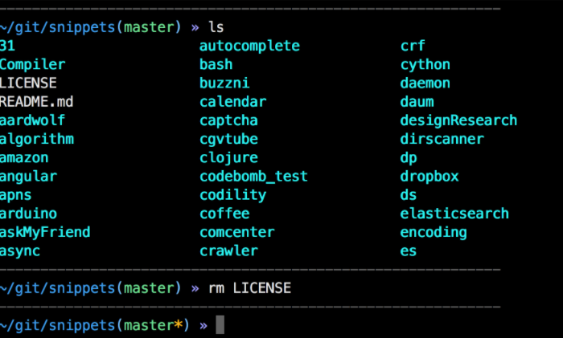

+ bash/csh再见了~~

+ 启用zsh：oh-my-zsh 安装参考网络吧~

+ 插件收集

  + zsh-syntax-highlighting
    作用 平常用的ls、cd 等命令输入正确会绿色高亮显示，输入错误会显示其他的颜色。
  + zsh-autosuggestions
    输入命令时，会给出建议的命令（灰色部分）按键盘 → 补全。
  + autojump
    作用 目录间快速跳转,不用再一直 cd 了。
  + extract
    所有类型的文件解压一个命令x全搞定，再也不需要去记tar后面到底是哪几个参数了。
  + history
  + sudo

+ bashrc导入
  懒癌患者在.zshrc中写入：

  ```shell
  [[ -e  ~/.profile ]] && emulate sh -c 'source ~/.profile'
  [[ -e  ~/.profile ]] && emulate sh -c 'source ~/.bashrc'
  ```

+ 以后就zsh吧~~~
​    