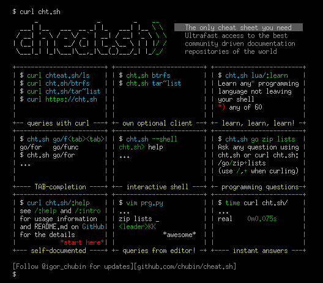

### 老了记不住就只能查了

* cheat.sh 是一个网站，更是一个实用的速查工具。

试想一下，一个理想的速查工具应该具备什么功能？

- 简洁：它只包含你需要的东西而不包含其他内容
- 快速：用户可以立即使用它
- 全面：包含你可能遇到的每个问题的答案
- 通用：在任何地方都可以随时可用，无需任何准备
- 不显眼：当你使用它时，它不会分散你当前任务的注意力

而这样的工具确实存在。

cheat.sh 具有以下这些功能特性：

- 简洁的 curl/browser 界面
- 涵盖 55 种编程语言，一些 DBMSes 和 1000 多个最重要的 UNIX/Linux 命令
- 无需安装，随处可用
- 超快，通常在 100 毫秒内即可返回答案
- 可以直接在代码编辑器中使用，无需打开浏览器
- ……

