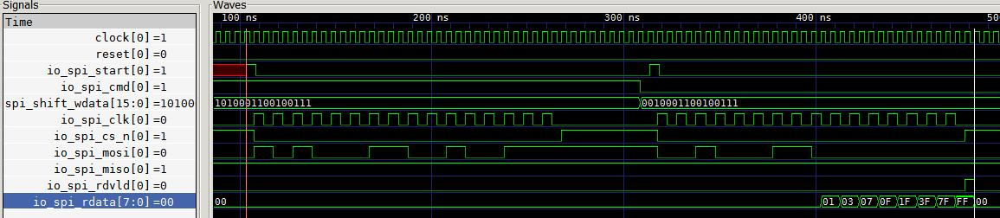
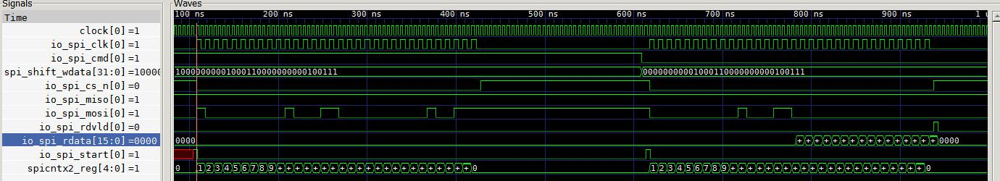

#### 刚开始写，非常不顺手，难度很大。对接口类代码确实不如verilog快，而且代码出来不易读，不过在算法，架构，CPU，GPU，图像，AI等方面应该是很快的。出来还得靠DVer把关。
```scala
package smr.rtlgenpkg

import scala.math._
import chisel3._
import chisel3.util._
import chisel3.experimental._
import dsptools.numbers._

class SpiParam {
  final val CMDWIDTH  = 1 // 1:wirte 0:read
  val ADDRWIDTH  = 7
  val DATAWIDTH  = 8
  final val TOTALWIDTH = CMDWIDTH + ADDRWIDTH + DATAWIDTH
  final val SPICNT     = 2*TOTALWIDTH
  final val SPICNTBITS = (log(SPICNT)/log(2)).ceil.toInt
  require(CMDWIDTH == 1,s"CMDWIDTH:$CMDWIDTH == 1")
  require(ADDRWIDTH > 0,s"ADDRWIDTH:$ADDRWIDTH > 0")
  require(DATAWIDTH > 0,s"DATAWIDTH:$DATAWIDTH > 0")
  require(pow(2,SPICNTBITS).toInt == SPICNT,s"pow(2,SPICNTBITS:$SPICNTBITS).toInt == $SPICNT")
}

class SpiParamExt extends {
  override val ADDRWIDTH  = 15
  override val DATAWIDTH  = 16
} with SpiParam

class SpiIO(val param:SpiParam) extends Bundle{
  val spi_start = Input(UInt(1.W))
  val spi_cmd   = Input(UInt(param.CMDWIDTH.W))
  val spi_addr  = Input(UInt(param.ADDRWIDTH.W))
  val spi_wdata = Input(UInt(param.DATAWIDTH.W))
  val spi_rdata = Output(UInt(param.DATAWIDTH.W))
  val spi_rdvld = Output(UInt(1.W))
  val spi_clk   = Output(UInt(1.W))
  val spi_cs_n  = Output(UInt(1.W))
  val spi_mosi  = Output(UInt(1.W))
  val spi_miso  = Input(UInt(1.W))
}

class SpiMaster(val param:SpiParam) extends Module{
  lazy val io = IO(new SpiIO(param))

  val Seq(spiseq_vld_reg,spi_clk_reg,
          spi_mosi_reg,spi_rdvld_reg) = Seq.fill(4)(RegInit(0.U(1.W)))
  val spi_miso_reg  = RegInit(0.U(param.DATAWIDTH.W))
  val spi_start     = io.spi_start

  val (spicnt,spicnt_wrap) = Counter(spiseq_vld_reg.asBool,param.SPICNT)

  when(spi_start === 1.U) {
    spiseq_vld_reg := 1.U
  }.elsewhen(spicnt_wrap === true.B) {
    spiseq_vld_reg := 0.U
  }

  when((spi_start === 1.U || spiseq_vld_reg === 1.U) && (spicnt =/= (param.SPICNT - 1).U)) {
    spi_clk_reg := ~spi_clk_reg
  }.otherwise {
    spi_clk_reg := 0.U
  }

  val spicntx2_reg = RegInit(0.U((param.SPICNTBITS - 1).W))
  when(spi_start === 1.U ||  (spiseq_vld_reg === 1.U && spi_clk_reg === 0.U && spicnt_wrap =/= true.B) ) {
    spicntx2_reg := spicntx2_reg + 1.U
  }.elsewhen(spicnt_wrap === true.B) {
    spicntx2_reg := 0.U
  }
   
  val spi_shift_wdata = Cat(io.spi_cmd,io.spi_addr,io.spi_wdata)
  val spi_shift_rdata = Cat(io.spi_cmd,io.spi_addr,0.U(param.DATAWIDTH.W))

  when(spi_start === 1.U || (spiseq_vld_reg === 1.U && spi_clk_reg === 0.U && spicnt_wrap =/= true.B)) {
    when(io.spi_cmd === 1.U) {//write
      spi_mosi_reg := spi_shift_wdata(param.TOTALWIDTH - 1 - spicntx2_reg)
    }.otherwise { //read
      spi_mosi_reg :=spi_shift_rdata(param.TOTALWIDTH - 1 - spicntx2_reg)
    }
  }

  when(spi_start === 1.U || spiseq_vld_reg === 1.U) {
     when(io.spi_cmd === 0.U) {
       when((spicnt >= 2*(param.CMDWIDTH+param.ADDRWIDTH)) && spi_clk_reg === 1.U) {
        spi_miso_reg := Cat(spi_miso_reg(param.DATAWIDTH - 2,0),io.spi_miso)
      }
    }
  }.otherwise {
    spi_miso_reg := 0.U
  }

  when(spi_start === 1.U || spiseq_vld_reg === 1.U) {
    when(io.spi_cmd === 0.U && spicnt_wrap === true.B) {
      spi_rdvld_reg := 1.U
    }
  }.elsewhen(spi_start === 0.U) {
    spi_rdvld_reg := 0.U
  }

  io.spi_cs_n  := ~spiseq_vld_reg 
  io.spi_clk   := spi_clk_reg
  io.spi_mosi  := spi_mosi_reg
  io.spi_rdata := spi_miso_reg
  io.spi_rdvld := spi_rdvld_reg

}
```
#### 生成的SpiMaster Verilog代码ADDR=7bits,DATA=8bits
```verilog
module SpiMaster( // @[:@3.2]
  input        clock, // @[:@4.4]
  input        reset, // @[:@5.4]
  input        io_spi_start, // @[:@6.4]
  input        io_spi_cmd, // @[:@6.4]
  input  [6:0] io_spi_addr, // @[:@6.4]
  input  [7:0] io_spi_wdata, // @[:@6.4]
  output [7:0] io_spi_rdata, // @[:@6.4]
  output       io_spi_rdvld, // @[:@6.4]
  output       io_spi_clk, // @[:@6.4]
  output       io_spi_cs_n, // @[:@6.4]
  output       io_spi_mosi, // @[:@6.4]
  input        io_spi_miso // @[:@6.4]
);
  reg  spiseq_vld_reg; // @[SPIDriver.scala 127:60:@8.4]
  reg [31:0] _RAND_0;
  reg  spi_clk_reg; // @[SPIDriver.scala 127:60:@9.4]
  reg [31:0] _RAND_1;
  reg  spi_mosi_reg; // @[SPIDriver.scala 127:60:@10.4]
  reg [31:0] _RAND_2;
  reg  spi_rdvld_reg; // @[SPIDriver.scala 127:60:@11.4]
  reg [31:0] _RAND_3;
  reg [7:0] spi_miso_reg; // @[SPIDriver.scala 128:30:@12.4]
  reg [31:0] _RAND_4;
  reg [4:0] value; // @[Counter.scala 26:33:@14.4]
  reg [31:0] _RAND_5;
  wire  _T_39; // @[Counter.scala 34:24:@16.6]
  wire [5:0] _T_41; // @[Counter.scala 35:22:@17.6]
  wire [4:0] _T_42; // @[Counter.scala 35:22:@18.6]
  wire [4:0] _GEN_0; // @[Counter.scala 63:17:@15.4]
  wire  spicnt_wrap; // @[Counter.scala 64:20:@21.4]
  wire  _GEN_1; // @[SPIDriver.scala 135:38:@28.6]
  wire  _GEN_2; // @[SPIDriver.scala 133:27:@23.4]
  wire  _T_53; // @[SPIDriver.scala 139:27:@33.4]
  wire  _T_55; // @[SPIDriver.scala 139:65:@34.4]
  wire  _T_56; // @[SPIDriver.scala 139:54:@35.4]
  wire  _T_57; // @[SPIDriver.scala 140:20:@37.6]
  wire  _GEN_3; // @[SPIDriver.scala 139:92:@36.4]
  reg [3:0] spicntx2_reg; // @[SPIDriver.scala 145:29:@43.4]
  reg [31:0] _RAND_6;
  wire  _T_66; // @[SPIDriver.scala 146:69:@46.4]
  wire  _T_67; // @[SPIDriver.scala 146:54:@47.4]
  wire  _T_69; // @[SPIDriver.scala 146:92:@48.4]
  wire  _T_70; // @[SPIDriver.scala 146:77:@49.4]
  wire  _T_71; // @[SPIDriver.scala 146:26:@50.4]
  wire [4:0] _T_73; // @[SPIDriver.scala 147:34:@52.6]
  wire [3:0] _T_74; // @[SPIDriver.scala 147:34:@53.6]
  wire [3:0] _GEN_4; // @[SPIDriver.scala 148:38:@58.6]
  wire [3:0] _GEN_5; // @[SPIDriver.scala 146:106:@51.4]
  wire [15:0] spi_shift_wdata; // @[Cat.scala 30:58:@62.4]
  wire [15:0] spi_shift_rdata; // @[Cat.scala 30:58:@64.4]
  wire [4:0] _T_95; // @[UIntTypeClass.scala 28:50:@75.8]
  wire [4:0] _T_96; // @[UIntTypeClass.scala 28:50:@76.8]
  wire [3:0] _T_97; // @[UIntTypeClass.scala 28:50:@77.8]
  wire [15:0] _T_98; // @[SPIDriver.scala 157:38:@78.8]
  wire  _T_99; // @[SPIDriver.scala 157:38:@79.8]
  wire [15:0] _T_104; // @[SPIDriver.scala 159:37:@86.8]
  wire  _T_105; // @[SPIDriver.scala 159:37:@87.8]
  wire  _GEN_6; // @[SPIDriver.scala 156:30:@74.6]
  wire  _GEN_7; // @[SPIDriver.scala 155:104:@72.4]
  wire  _T_112; // @[SPIDriver.scala 164:22:@95.6]
  wire  _T_114; // @[UIntTypeClass.scala 55:50:@97.8]
  wire  _T_117; // @[SPIDriver.scala 165:60:@99.8]
  wire [6:0] _T_118; // @[SPIDriver.scala 166:41:@101.10]
  wire [7:0] _T_119; // @[Cat.scala 30:58:@102.10]
  wire [7:0] _GEN_8; // @[SPIDriver.scala 165:84:@100.8]
  wire [7:0] _GEN_9; // @[SPIDriver.scala 164:31:@96.6]
  wire [7:0] _GEN_10; // @[SPIDriver.scala 163:53:@94.4]
  wire  _T_130; // @[SPIDriver.scala 174:29:@116.6]
  wire  _GEN_11; // @[SPIDriver.scala 174:56:@117.6]
  wire  _T_133; // @[SPIDriver.scala 177:24:@122.6]
  wire  _GEN_12; // @[SPIDriver.scala 177:33:@123.6]
  wire  _GEN_13; // @[SPIDriver.scala 173:53:@113.4]
  assign _T_39 = value == 5'h1f; // @[Counter.scala 34:24:@16.6]
  assign _T_41 = value + 5'h1; // @[Counter.scala 35:22:@17.6]
  assign _T_42 = value + 5'h1; // @[Counter.scala 35:22:@18.6]
  assign _GEN_0 = spiseq_vld_reg ? _T_42 : value; // @[Counter.scala 63:17:@15.4]
  assign spicnt_wrap = spiseq_vld_reg & _T_39; // @[Counter.scala 64:20:@21.4]
  assign _GEN_1 = spicnt_wrap ? 1'h0 : spiseq_vld_reg; // @[SPIDriver.scala 135:38:@28.6]
  assign _GEN_2 = io_spi_start ? 1'h1 : _GEN_1; // @[SPIDriver.scala 133:27:@23.4]
  assign _T_53 = io_spi_start | spiseq_vld_reg; // @[SPIDriver.scala 139:27:@33.4]
  assign _T_55 = value != 5'h1f; // @[SPIDriver.scala 139:65:@34.4]
  assign _T_56 = _T_53 & _T_55; // @[SPIDriver.scala 139:54:@35.4]
  assign _T_57 = ~ spi_clk_reg; // @[SPIDriver.scala 140:20:@37.6]
  assign _GEN_3 = _T_56 ? _T_57 : 1'h0; // @[SPIDriver.scala 139:92:@36.4]
  assign _T_66 = spi_clk_reg == 1'h0; // @[SPIDriver.scala 146:69:@46.4]
  assign _T_67 = spiseq_vld_reg & _T_66; // @[SPIDriver.scala 146:54:@47.4]
  assign _T_69 = spicnt_wrap != 1'h1; // @[SPIDriver.scala 146:92:@48.4]
  assign _T_70 = _T_67 & _T_69; // @[SPIDriver.scala 146:77:@49.4]
  assign _T_71 = io_spi_start | _T_70; // @[SPIDriver.scala 146:26:@50.4]
  assign _T_73 = spicntx2_reg + 4'h1; // @[SPIDriver.scala 147:34:@52.6]
  assign _T_74 = spicntx2_reg + 4'h1; // @[SPIDriver.scala 147:34:@53.6]
  assign _GEN_4 = spicnt_wrap ? 4'h0 : spicntx2_reg; // @[SPIDriver.scala 148:38:@58.6]
  assign _GEN_5 = _T_71 ? _T_74 : _GEN_4; // @[SPIDriver.scala 146:106:@51.4]
  assign spi_shift_wdata = {io_spi_cmd,io_spi_addr,io_spi_wdata}; // @[Cat.scala 30:58:@62.4]
  assign spi_shift_rdata = {io_spi_cmd,io_spi_addr,8'h0}; // @[Cat.scala 30:58:@64.4]
  assign _T_95 = 4'hf - spicntx2_reg; // @[UIntTypeClass.scala 28:50:@75.8]
  assign _T_96 = $unsigned(_T_95); // @[UIntTypeClass.scala 28:50:@76.8]
  assign _T_97 = _T_96[3:0]; // @[UIntTypeClass.scala 28:50:@77.8]
  assign _T_98 = spi_shift_wdata >> _T_97; // @[SPIDriver.scala 157:38:@78.8]
  assign _T_99 = _T_98[0]; // @[SPIDriver.scala 157:38:@79.8]
  assign _T_104 = spi_shift_rdata >> _T_97; // @[SPIDriver.scala 159:37:@86.8]
  assign _T_105 = _T_104[0]; // @[SPIDriver.scala 159:37:@87.8]
  assign _GEN_6 = io_spi_cmd ? _T_99 : _T_105; // @[SPIDriver.scala 156:30:@74.6]
  assign _GEN_7 = _T_71 ? _GEN_6 : spi_mosi_reg; // @[SPIDriver.scala 155:104:@72.4]
  assign _T_112 = io_spi_cmd == 1'h0; // @[SPIDriver.scala 164:22:@95.6]
  assign _T_114 = value >= 5'h10; // @[UIntTypeClass.scala 55:50:@97.8]
  assign _T_117 = _T_114 & spi_clk_reg; // @[SPIDriver.scala 165:60:@99.8]
  assign _T_118 = spi_miso_reg[6:0]; // @[SPIDriver.scala 166:41:@101.10]
  assign _T_119 = {_T_118,io_spi_miso}; // @[Cat.scala 30:58:@102.10]
  assign _GEN_8 = _T_117 ? _T_119 : spi_miso_reg; // @[SPIDriver.scala 165:84:@100.8]
  assign _GEN_9 = _T_112 ? _GEN_8 : spi_miso_reg; // @[SPIDriver.scala 164:31:@96.6]
  assign _GEN_10 = _T_53 ? _GEN_9 : 8'h0; // @[SPIDriver.scala 163:53:@94.4]
  assign _T_130 = _T_112 & spicnt_wrap; // @[SPIDriver.scala 174:29:@116.6]
  assign _GEN_11 = _T_130 ? 1'h1 : spi_rdvld_reg; // @[SPIDriver.scala 174:56:@117.6]
  assign _T_133 = io_spi_start == 1'h0; // @[SPIDriver.scala 177:24:@122.6]
  assign _GEN_12 = _T_133 ? 1'h0 : spi_rdvld_reg; // @[SPIDriver.scala 177:33:@123.6]
  assign _GEN_13 = _T_53 ? _GEN_11 : _GEN_12; // @[SPIDriver.scala 173:53:@113.4]
  assign io_spi_rdata = spi_miso_reg; // @[SPIDriver.scala 184:16:@130.4]
  assign io_spi_rdvld = spi_rdvld_reg; // @[SPIDriver.scala 185:16:@131.4]
  assign io_spi_clk = spi_clk_reg; // @[SPIDriver.scala 182:16:@128.4]
  assign io_spi_cs_n = ~ spiseq_vld_reg; // @[SPIDriver.scala 181:16:@127.4]
  assign io_spi_mosi = spi_mosi_reg; // @[SPIDriver.scala 183:16:@129.4]
`ifdef RANDOMIZE_GARBAGE_ASSIGN
`define RANDOMIZE
`endif
`ifdef RANDOMIZE_INVALID_ASSIGN
`define RANDOMIZE
`endif
`ifdef RANDOMIZE_REG_INIT
`define RANDOMIZE
`endif
`ifdef RANDOMIZE_MEM_INIT
`define RANDOMIZE
`endif
`ifndef RANDOM
`define RANDOM $random
`endif
`ifdef RANDOMIZE
  integer initvar;
  initial begin
    `ifdef INIT_RANDOM
      `INIT_RANDOM
    `endif
    `ifndef VERILATOR
      #0.002 begin end
    `endif
  `ifdef RANDOMIZE_REG_INIT
  _RAND_0 = {1{`RANDOM}};
  spiseq_vld_reg = _RAND_0[0:0];
  `endif // RANDOMIZE_REG_INIT
  `ifdef RANDOMIZE_REG_INIT
  _RAND_1 = {1{`RANDOM}};
  spi_clk_reg = _RAND_1[0:0];
  `endif // RANDOMIZE_REG_INIT
  `ifdef RANDOMIZE_REG_INIT
  _RAND_2 = {1{`RANDOM}};
  spi_mosi_reg = _RAND_2[0:0];
  `endif // RANDOMIZE_REG_INIT
  `ifdef RANDOMIZE_REG_INIT
  _RAND_3 = {1{`RANDOM}};
  spi_rdvld_reg = _RAND_3[0:0];
  `endif // RANDOMIZE_REG_INIT
  `ifdef RANDOMIZE_REG_INIT
  _RAND_4 = {1{`RANDOM}};
  spi_miso_reg = _RAND_4[7:0];
  `endif // RANDOMIZE_REG_INIT
  `ifdef RANDOMIZE_REG_INIT
  _RAND_5 = {1{`RANDOM}};
  value = _RAND_5[4:0];
  `endif // RANDOMIZE_REG_INIT
  `ifdef RANDOMIZE_REG_INIT
  _RAND_6 = {1{`RANDOM}};
  spicntx2_reg = _RAND_6[3:0];
  `endif // RANDOMIZE_REG_INIT
  end
`endif // RANDOMIZE
  always @(posedge clock) begin
    if (reset) begin
      spiseq_vld_reg <= 1'h0;
    end else begin
      if (io_spi_start) begin
        spiseq_vld_reg <= 1'h1;
      end else begin
        if (spicnt_wrap) begin
          spiseq_vld_reg <= 1'h0;
        end
      end
    end
    if (reset) begin
      spi_clk_reg <= 1'h0;
    end else begin
      if (_T_56) begin
        spi_clk_reg <= _T_57;
      end else begin
        spi_clk_reg <= 1'h0;
      end
    end
    if (reset) begin
      spi_mosi_reg <= 1'h0;
    end else begin
      if (_T_71) begin
        if (io_spi_cmd) begin
          spi_mosi_reg <= _T_99;
        end else begin
          spi_mosi_reg <= _T_105;
        end
      end
    end
    if (reset) begin
      spi_rdvld_reg <= 1'h0;
    end else begin
      if (_T_53) begin
        if (_T_130) begin
          spi_rdvld_reg <= 1'h1;
        end
      end else begin
        if (_T_133) begin
          spi_rdvld_reg <= 1'h0;
        end
      end
    end
    if (reset) begin
      spi_miso_reg <= 8'h0;
    end else begin
      if (_T_53) begin
        if (_T_112) begin
          if (_T_117) begin
            spi_miso_reg <= _T_119;
          end
        end
      end else begin
        spi_miso_reg <= 8'h0;
      end
    end
    if (reset) begin
      value <= 5'h0;
    end else begin
      if (spiseq_vld_reg) begin
        value <= _T_42;
      end
    end
    if (reset) begin
      spicntx2_reg <= 4'h0;
    end else begin
      if (_T_71) begin
        spicntx2_reg <= _T_74;
      end else begin
        if (spicnt_wrap) begin
          spicntx2_reg <= 4'h0;
        end
      end
    end
  end
endmodule
```
#### 仿真波形


#### 生成的SpiMaster Verilog代码ADDR=15bits,DATA=16bits
```verilog
module SpiMaster( // @[:@3.2]
  input         clock, // @[:@4.4]
  input         reset, // @[:@5.4]
  input         io_spi_start, // @[:@6.4]
  input         io_spi_cmd, // @[:@6.4]
  input  [14:0] io_spi_addr, // @[:@6.4]
  input  [15:0] io_spi_wdata, // @[:@6.4]
  output [15:0] io_spi_rdata, // @[:@6.4]
  output        io_spi_rdvld, // @[:@6.4]
  output        io_spi_clk, // @[:@6.4]
  output        io_spi_cs_n, // @[:@6.4]
  output        io_spi_mosi, // @[:@6.4]
  input         io_spi_miso // @[:@6.4]
);
  reg  spiseq_vld_reg; // @[SPIDriver.scala 127:60:@8.4]
  reg [31:0] _RAND_0;
  reg  spi_clk_reg; // @[SPIDriver.scala 127:60:@9.4]
  reg [31:0] _RAND_1;
  reg  spi_mosi_reg; // @[SPIDriver.scala 127:60:@10.4]
  reg [31:0] _RAND_2;
  reg  spi_rdvld_reg; // @[SPIDriver.scala 127:60:@11.4]
  reg [31:0] _RAND_3;
  reg [15:0] spi_miso_reg; // @[SPIDriver.scala 128:30:@12.4]
  reg [31:0] _RAND_4;
  reg [5:0] value; // @[Counter.scala 26:33:@14.4]
  reg [31:0] _RAND_5;
  wire  _T_39; // @[Counter.scala 34:24:@16.6]
  wire [6:0] _T_41; // @[Counter.scala 35:22:@17.6]
  wire [5:0] _T_42; // @[Counter.scala 35:22:@18.6]
  wire [5:0] _GEN_0; // @[Counter.scala 63:17:@15.4]
  wire  spicnt_wrap; // @[Counter.scala 64:20:@21.4]
  wire  _GEN_1; // @[SPIDriver.scala 135:38:@28.6]
  wire  _GEN_2; // @[SPIDriver.scala 133:27:@23.4]
  wire  _T_53; // @[SPIDriver.scala 139:27:@33.4]
  wire  _T_55; // @[SPIDriver.scala 139:65:@34.4]
  wire  _T_56; // @[SPIDriver.scala 139:54:@35.4]
  wire  _T_57; // @[SPIDriver.scala 140:20:@37.6]
  wire  _GEN_3; // @[SPIDriver.scala 139:92:@36.4]
  reg [4:0] spicntx2_reg; // @[SPIDriver.scala 145:29:@43.4]
  reg [31:0] _RAND_6;
  wire  _T_66; // @[SPIDriver.scala 146:69:@46.4]
  wire  _T_67; // @[SPIDriver.scala 146:54:@47.4]
  wire  _T_69; // @[SPIDriver.scala 146:92:@48.4]
  wire  _T_70; // @[SPIDriver.scala 146:77:@49.4]
  wire  _T_71; // @[SPIDriver.scala 146:26:@50.4]
  wire [5:0] _T_73; // @[SPIDriver.scala 147:34:@52.6]
  wire [4:0] _T_74; // @[SPIDriver.scala 147:34:@53.6]
  wire [4:0] _GEN_4; // @[SPIDriver.scala 148:38:@58.6]
  wire [4:0] _GEN_5; // @[SPIDriver.scala 146:106:@51.4]
  wire [31:0] spi_shift_wdata; // @[Cat.scala 30:58:@62.4]
  wire [31:0] spi_shift_rdata; // @[Cat.scala 30:58:@64.4]
  wire [5:0] _T_95; // @[UIntTypeClass.scala 28:50:@75.8]
  wire [5:0] _T_96; // @[UIntTypeClass.scala 28:50:@76.8]
  wire [4:0] _T_97; // @[UIntTypeClass.scala 28:50:@77.8]
  wire [31:0] _T_98; // @[SPIDriver.scala 157:38:@78.8]
  wire  _T_99; // @[SPIDriver.scala 157:38:@79.8]
  wire [31:0] _T_104; // @[SPIDriver.scala 159:37:@86.8]
  wire  _T_105; // @[SPIDriver.scala 159:37:@87.8]
  wire  _GEN_6; // @[SPIDriver.scala 156:30:@74.6]
  wire  _GEN_7; // @[SPIDriver.scala 155:104:@72.4]
  wire  _T_112; // @[SPIDriver.scala 164:22:@95.6]
  wire  _T_114; // @[UIntTypeClass.scala 55:50:@97.8]
  wire  _T_117; // @[SPIDriver.scala 165:60:@99.8]
  wire [14:0] _T_118; // @[SPIDriver.scala 166:41:@101.10]
  wire [15:0] _T_119; // @[Cat.scala 30:58:@102.10]
  wire [15:0] _GEN_8; // @[SPIDriver.scala 165:84:@100.8]
  wire [15:0] _GEN_9; // @[SPIDriver.scala 164:31:@96.6]
  wire [15:0] _GEN_10; // @[SPIDriver.scala 163:53:@94.4]
  wire  _T_130; // @[SPIDriver.scala 174:29:@116.6]
  wire  _GEN_11; // @[SPIDriver.scala 174:56:@117.6]
  wire  _T_133; // @[SPIDriver.scala 177:24:@122.6]
  wire  _GEN_12; // @[SPIDriver.scala 177:33:@123.6]
  wire  _GEN_13; // @[SPIDriver.scala 173:53:@113.4]
  assign _T_39 = value == 6'h3f; // @[Counter.scala 34:24:@16.6]
  assign _T_41 = value + 6'h1; // @[Counter.scala 35:22:@17.6]
  assign _T_42 = value + 6'h1; // @[Counter.scala 35:22:@18.6]
  assign _GEN_0 = spiseq_vld_reg ? _T_42 : value; // @[Counter.scala 63:17:@15.4]
  assign spicnt_wrap = spiseq_vld_reg & _T_39; // @[Counter.scala 64:20:@21.4]
  assign _GEN_1 = spicnt_wrap ? 1'h0 : spiseq_vld_reg; // @[SPIDriver.scala 135:38:@28.6]
  assign _GEN_2 = io_spi_start ? 1'h1 : _GEN_1; // @[SPIDriver.scala 133:27:@23.4]
  assign _T_53 = io_spi_start | spiseq_vld_reg; // @[SPIDriver.scala 139:27:@33.4]
  assign _T_55 = value != 6'h3f; // @[SPIDriver.scala 139:65:@34.4]
  assign _T_56 = _T_53 & _T_55; // @[SPIDriver.scala 139:54:@35.4]
  assign _T_57 = ~ spi_clk_reg; // @[SPIDriver.scala 140:20:@37.6]
  assign _GEN_3 = _T_56 ? _T_57 : 1'h0; // @[SPIDriver.scala 139:92:@36.4]
  assign _T_66 = spi_clk_reg == 1'h0; // @[SPIDriver.scala 146:69:@46.4]
  assign _T_67 = spiseq_vld_reg & _T_66; // @[SPIDriver.scala 146:54:@47.4]
  assign _T_69 = spicnt_wrap != 1'h1; // @[SPIDriver.scala 146:92:@48.4]
  assign _T_70 = _T_67 & _T_69; // @[SPIDriver.scala 146:77:@49.4]
  assign _T_71 = io_spi_start | _T_70; // @[SPIDriver.scala 146:26:@50.4]
  assign _T_73 = spicntx2_reg + 5'h1; // @[SPIDriver.scala 147:34:@52.6]
  assign _T_74 = spicntx2_reg + 5'h1; // @[SPIDriver.scala 147:34:@53.6]
  assign _GEN_4 = spicnt_wrap ? 5'h0 : spicntx2_reg; // @[SPIDriver.scala 148:38:@58.6]
  assign _GEN_5 = _T_71 ? _T_74 : _GEN_4; // @[SPIDriver.scala 146:106:@51.4]
  assign spi_shift_wdata = {io_spi_cmd,io_spi_addr,io_spi_wdata}; // @[Cat.scala 30:58:@62.4]
  assign spi_shift_rdata = {io_spi_cmd,io_spi_addr,16'h0}; // @[Cat.scala 30:58:@64.4]
  assign _T_95 = 5'h1f - spicntx2_reg; // @[UIntTypeClass.scala 28:50:@75.8]
  assign _T_96 = $unsigned(_T_95); // @[UIntTypeClass.scala 28:50:@76.8]
  assign _T_97 = _T_96[4:0]; // @[UIntTypeClass.scala 28:50:@77.8]
  assign _T_98 = spi_shift_wdata >> _T_97; // @[SPIDriver.scala 157:38:@78.8]
  assign _T_99 = _T_98[0]; // @[SPIDriver.scala 157:38:@79.8]
  assign _T_104 = spi_shift_rdata >> _T_97; // @[SPIDriver.scala 159:37:@86.8]
  assign _T_105 = _T_104[0]; // @[SPIDriver.scala 159:37:@87.8]
  assign _GEN_6 = io_spi_cmd ? _T_99 : _T_105; // @[SPIDriver.scala 156:30:@74.6]
  assign _GEN_7 = _T_71 ? _GEN_6 : spi_mosi_reg; // @[SPIDriver.scala 155:104:@72.4]
  assign _T_112 = io_spi_cmd == 1'h0; // @[SPIDriver.scala 164:22:@95.6]
  assign _T_114 = value >= 6'h20; // @[UIntTypeClass.scala 55:50:@97.8]
  assign _T_117 = _T_114 & spi_clk_reg; // @[SPIDriver.scala 165:60:@99.8]
  assign _T_118 = spi_miso_reg[14:0]; // @[SPIDriver.scala 166:41:@101.10]
  assign _T_119 = {_T_118,io_spi_miso}; // @[Cat.scala 30:58:@102.10]
  assign _GEN_8 = _T_117 ? _T_119 : spi_miso_reg; // @[SPIDriver.scala 165:84:@100.8]
  assign _GEN_9 = _T_112 ? _GEN_8 : spi_miso_reg; // @[SPIDriver.scala 164:31:@96.6]
  assign _GEN_10 = _T_53 ? _GEN_9 : 16'h0; // @[SPIDriver.scala 163:53:@94.4]
  assign _T_130 = _T_112 & spicnt_wrap; // @[SPIDriver.scala 174:29:@116.6]
  assign _GEN_11 = _T_130 ? 1'h1 : spi_rdvld_reg; // @[SPIDriver.scala 174:56:@117.6]
  assign _T_133 = io_spi_start == 1'h0; // @[SPIDriver.scala 177:24:@122.6]
  assign _GEN_12 = _T_133 ? 1'h0 : spi_rdvld_reg; // @[SPIDriver.scala 177:33:@123.6]
  assign _GEN_13 = _T_53 ? _GEN_11 : _GEN_12; // @[SPIDriver.scala 173:53:@113.4]
  assign io_spi_rdata = spi_miso_reg; // @[SPIDriver.scala 184:16:@130.4]
  assign io_spi_rdvld = spi_rdvld_reg; // @[SPIDriver.scala 185:16:@131.4]
  assign io_spi_clk = spi_clk_reg; // @[SPIDriver.scala 182:16:@128.4]
  assign io_spi_cs_n = ~ spiseq_vld_reg; // @[SPIDriver.scala 181:16:@127.4]
  assign io_spi_mosi = spi_mosi_reg; // @[SPIDriver.scala 183:16:@129.4]
`ifdef RANDOMIZE_GARBAGE_ASSIGN
`define RANDOMIZE
`endif
`ifdef RANDOMIZE_INVALID_ASSIGN
`define RANDOMIZE
`endif
`ifdef RANDOMIZE_REG_INIT
`define RANDOMIZE
`endif
`ifdef RANDOMIZE_MEM_INIT
`define RANDOMIZE
`endif
`ifndef RANDOM
`define RANDOM $random
`endif
`ifdef RANDOMIZE
  integer initvar;
  initial begin
    `ifdef INIT_RANDOM
      `INIT_RANDOM
    `endif
    `ifndef VERILATOR
      #0.002 begin end
    `endif
  `ifdef RANDOMIZE_REG_INIT
  _RAND_0 = {1{`RANDOM}};
  spiseq_vld_reg = _RAND_0[0:0];
  `endif // RANDOMIZE_REG_INIT
  `ifdef RANDOMIZE_REG_INIT
  _RAND_1 = {1{`RANDOM}};
  spi_clk_reg = _RAND_1[0:0];
  `endif // RANDOMIZE_REG_INIT
  `ifdef RANDOMIZE_REG_INIT
  _RAND_2 = {1{`RANDOM}};
  spi_mosi_reg = _RAND_2[0:0];
  `endif // RANDOMIZE_REG_INIT
  `ifdef RANDOMIZE_REG_INIT
  _RAND_3 = {1{`RANDOM}};
  spi_rdvld_reg = _RAND_3[0:0];
  `endif // RANDOMIZE_REG_INIT
  `ifdef RANDOMIZE_REG_INIT
  _RAND_4 = {1{`RANDOM}};
  spi_miso_reg = _RAND_4[15:0];
  `endif // RANDOMIZE_REG_INIT
  `ifdef RANDOMIZE_REG_INIT
  _RAND_5 = {1{`RANDOM}};
  value = _RAND_5[5:0];
  `endif // RANDOMIZE_REG_INIT
  `ifdef RANDOMIZE_REG_INIT
  _RAND_6 = {1{`RANDOM}};
  spicntx2_reg = _RAND_6[4:0];
  `endif // RANDOMIZE_REG_INIT
  end
`endif // RANDOMIZE
  always @(posedge clock) begin
    if (reset) begin
      spiseq_vld_reg <= 1'h0;
    end else begin
      if (io_spi_start) begin
        spiseq_vld_reg <= 1'h1;
      end else begin
        if (spicnt_wrap) begin
          spiseq_vld_reg <= 1'h0;
        end
      end
    end
    if (reset) begin
      spi_clk_reg <= 1'h0;
    end else begin
      if (_T_56) begin
        spi_clk_reg <= _T_57;
      end else begin
        spi_clk_reg <= 1'h0;
      end
    end
    if (reset) begin
      spi_mosi_reg <= 1'h0;
    end else begin
      if (_T_71) begin
        if (io_spi_cmd) begin
          spi_mosi_reg <= _T_99;
        end else begin
          spi_mosi_reg <= _T_105;
        end
      end
    end
    if (reset) begin
      spi_rdvld_reg <= 1'h0;
    end else begin
      if (_T_53) begin
        if (_T_130) begin
          spi_rdvld_reg <= 1'h1;
        end
      end else begin
        if (_T_133) begin
          spi_rdvld_reg <= 1'h0;
        end
      end
    end
    if (reset) begin
      spi_miso_reg <= 16'h0;
    end else begin
      if (_T_53) begin
        if (_T_112) begin
          if (_T_117) begin
            spi_miso_reg <= _T_119;
          end
        end
      end else begin
        spi_miso_reg <= 16'h0;
      end
    end
    if (reset) begin
      value <= 6'h0;
    end else begin
      if (spiseq_vld_reg) begin
        value <= _T_42;
      end
    end
    if (reset) begin
      spicntx2_reg <= 5'h0;
    end else begin
      if (_T_71) begin
        spicntx2_reg <= _T_74;
      end else begin
        if (spicnt_wrap) begin
          spicntx2_reg <= 5'h0;
        end
      end
    end
  end
endmodule

```
#### 仿真波形


#### DVer工作量不少反增加~~~
