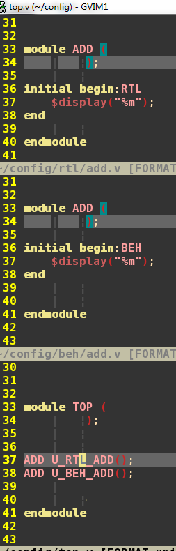
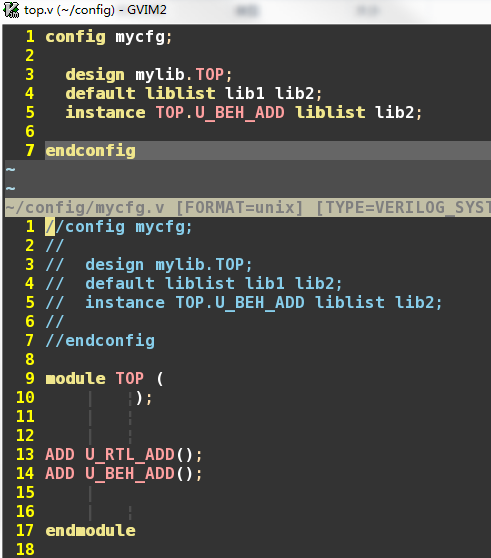
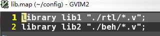
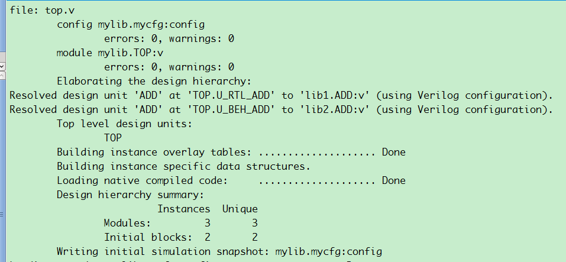
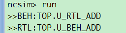

### 想例化不一样的instance，但是用不同功能的同名module，如rtl，netlist，beh模型等。
#### 记住把HEAD预处理宏去除。。。嗨，卡了一天死活不成功，原来是预处理宏给注释同样的module名字！！！！

相关代码：






### NCsim
#### config嵌入式编译
* lib1,lib2已经预先编译时，采用如下运行：
```
	irun -cdslib cds.lib -compcnfg  -top mycfg -libverbose top.v -work mylib
```
* lib1,lib2没有预先编译时，采用如下运行：
```
	irun -compcnfg  -top mycfg -libverbose -work mylib -libmap lib.map top.v ./beh/add.v ./rtl/add.v
```


#### config分离编译
* lib1,lib2已经预先编译时，采用如下运行：
```
	irun -cdslib cds.lib -compcnfg  -top mycfg -libverbose top.v -work mylib mycfg.v
```
* lib1,lib2没有预先编译时，不过必须先mkdir库，采用如下运行：
```
	irun -compcnfg  -top mycfg -libverbose -work mylib -libmap lib.map top.v ./beh/add.v ./rtl/add.v mycfg.v
```
### VCS类似：略去。
