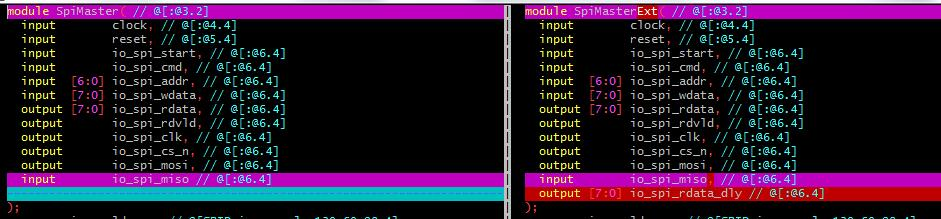
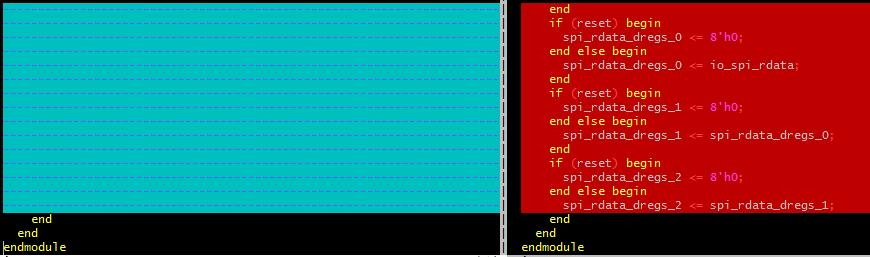
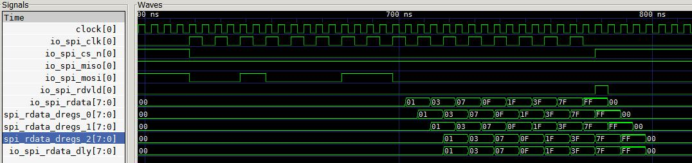

#### 新需求太多，改动多，Chisel通过多种方法进行快速迭代生成代码，如下例子新需求：SpiMaster需要把读取的数据延迟可配~
```scala
class SpiIOExt extends {
  override val param:SpiParam = new SpiParam
} with SpiIO(param) {
  val spi_rdata_dly = Output(UInt(param.DATAWIDTH.W))
}

class SpiMasterExt(val delay:Int = 1) extends {
  override val param:SpiParam = new SpiParam 
} with SpiMaster(param) {

  require(delay >= 1,s"delay:$delay >= 1")

  override lazy val io = IO(new SpiIOExt)

  val spi_rdata_dregs = RegInit(VecInit(Seq.fill(delay)(0.U(param.DATAWIDTH.W))))

  if(delay == 1)
    spi_rdata_dregs(0) := io.spi_rdata
  else {
    spi_rdata_dregs(0) := io.spi_rdata
    for(i <- 0 until spi_rdata_dregs.length - 1) {
      spi_rdata_dregs(i+1) := spi_rdata_dregs(i)
    }
  }

  io.spi_rdata_dly := spi_rdata_dregs(delay - 1)
}
```
#### 延迟3个时钟生成代码的区别


#### 延迟3个时钟读取数据的新波形


