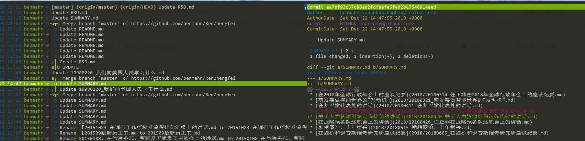

####  tig 是一款优化 git 命令行的工具，使 git 命令行更加的便捷人性化 。

*感觉不错，试用中，网络copy下操作啦。。。。。*

在 Repo 文件夹下，输入 【 tig 】+ 【 Enter 】即可进入 tig 模式。



此时展现在面前的将会是本地所有的 commit 记录以及分支的演化。
【 j 】【 k 】可上下切换选中的行，【 Enter 】可分屏查看当前 commit 记录详情，【 l 】小写的 L，全屏查看 commit 记录。
【 r 】进入 refs view  模式，查看所有分支，使用 【 j/k 】上下切换， 【 Enter 】查看分支演化。
【 s 】进入 status view，效果同 git status 命令，会展示所有 Untracked 和 UnStaged 文件。 选中 Unstaged 的文件键入【 u 】效果同 git add ，选中 staged 的文件键入 【 u 】效果同 git reset，即撤销 add 操作。【 Enter 】查看分屏查看当前文件的修改记录。
status view 模式下键入 【 C 】进入 vim 编辑器，【 i 】进入编辑模式，在第一行输入 commit 信息，【 :x 】退出并保存。【 m 】查看 commit 记录。
【 c 】进入 stash view 模式，全屏查看修改记录，可配合 【 s 】 使用。
【 t 】进入 tree view 模式，git 目录会以文件夹的形式展示。【 Enter】进入子目录，【 , 】返回上一级目录。
【 m 】进入 main view 查看当前分支的所有 commit 记录，使用 【 j/k 】上下切换，【 回车 】可分屏查看 commit  详情。同样，【 j/k 】上下移动，【空格】翻页。
main view 可以认为是主页。
【 / 】输入关键字可进行搜索。
【 R 】刷新当前页面，可退出搜索的高亮状态。
【 Q 】退出 tig。
【 h 】查看快捷键帮助。
tig 可以设置作用域，如果只想关注某个文件夹的修改记录，可使用 【 tig 文件夹名】。
如果只想展示某一段时间的 commit 记录， tig --after=“2018-01-01 --before="2018-05-12”。如果希望不写引号，可以使用tig --after==May.10th。
在分屏状态下，使用 Tab 切换左右屏幕，也可以在选中右侧屏幕时，按住 【 shift 】上下切换操作效果会在左侧屏幕生效。
从以上的介绍来看，tig 更偏向于查看（view）。

上文快捷键其实是默认的配置，所以我们可以自定义。自定义文件在~/.tigrc目录，如果安装完成后没有这个文件，需自行创建，并拷贝系统配置 后进行修改。
例如，不喜欢【 t 】显示的文件夹颜色，可以将 blue 改为 red。

```bash
color "tree "    blue    default
```

tig 支持 bind 的语法，来实现自定义快捷键，映射到具体的 git 命令。bind status 意思是在 statsu view  模式下（【 s 】键进入）才会生效，P 的功能为 git push。
bind status P !git push

! 代表立即执行。
在 .tigrc 文件中：

```bash
bind refs  C  ?git checkout %(branch)
```

代表 refs view 模式下，键入【 C 】checkout 分支，执行前会请求确认。
