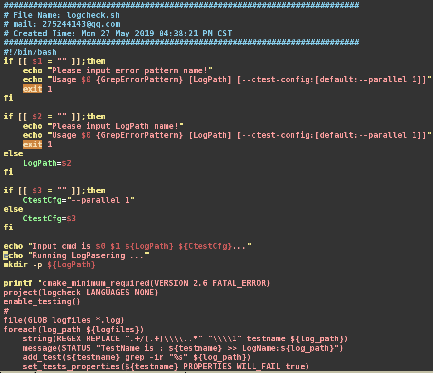

#### 盗用了CTest思想，做了一个ErrorPattern漂亮的查找Dashboard~~~

+ 假设所有的仿真log都在文件夹LOG下，并且都是以.log结尾
  LOG/
  ├── test0.log
  ├── test1.log
  ├── test2.log
  └── test3.log
+ 个别文件中可能含有mismatch关键字， 用于判断此testcase 是否fail.


```shell
$./logcheck.sh mismatch
Input cmd is ./logcheck.sh mismatch ./LOG
Running LogPasering ...
-- TestName is : test0 >> LogName:./LOG/test0.log
-- TestName is : test1 >> LogName:./LOG/test1.log
-- TestName is : test2 >> LogName:./LOG/test2.log
-- TestName is : test3 >> LogName:./LOG/test3.log
-- Configuring done
-- Generating done
-- Build files have been written to: ./LOG/build
Test project ./LOG/build
    Start 1: test0
1/4 Test #1: test0 ............................   Passed    0.00 sec
    Start 2: test1
2/4 Test #2: test1 ............................***Failed    0.00 sec
    Start 3: test2
3/4 Test #3: test2 ............................***Failed    0.00 sec
    Start 4: test3
4/4 Test #4: test3 ............................   Passed    0.00 sec

50% tests passed, 2 tests failed out of 4

Total Test time (real) =   0.02 sec

The following tests FAILED:
	  2 - test1 (Failed)
	  3 - test2 (Failed)
```

+ 代码片段，详细代码@QQ.

  