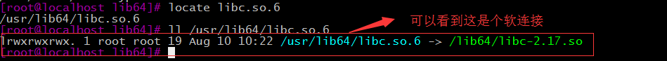

### (转：大坑啊~~~~)

大家在linux中操作命令时，由于某些操作会导致误删除一些文件，也许这些文件就是大部分命令所依赖的，删除会导致什么问题呢？接下来就一起看看。

  首先普及一下关于libc.so.6的基本常识：

​       首先敲一下命令：cd /lib64    然后敲这个命令：locate libc.so.6 最后敲：ll libc.so.6

​       我们可以看到以下：

​    

​      glibc是gnu发布的libc库，即c运行库。glibc是linux系统中最底层的api，几乎其它任何运行库都会依赖于glibc，所以说绝大部分操作命令都缺少不了它。

​      如果误删了/lib64/libc.so.6，大部分系统命令将无法执行，ssh登录系统也不成功，只会无休止的提示以下错误:error while loading shared libraries: libc.so.6: cannot open shared object file: No such file or directory.     

​      鉴于这种情况，大部分命令已经不能执行了，只能执行例如cd,echo等小部分命令，而实用的cp,mv则更不可用。从上图中可以查看/lib64/libc.so.6得知是属于libc-2.17.so的软链接，因此，libc-2.17.so文件肯定还是存在的，误删的只是软链接而已，但此时想用ln命令重新建立软链接是失败的，但是可以这样强制设置变量就能执行成功

LD_PRELOAD=/lib64/libc-2.5.so  ln -s /lib64/libc-2.5.so /lib64/libc.so.6

​     注意的是，这整条命令要在同一行执行，不能分两行，否则就无效了.例如下图：

这样你的机器就ok啦（**在误删除命令时千万不要关闭终端哦，就在当前终端敲上图命令**）

​     通过前面设置一下LD_PRELOAD变量，后面也是可以执行其它例如cp,mv等命令的

​    例如我一开始不是误删，只是把libc.so.6改名了，从而也导致了上面的错误，于是就可以按照下面方法恢复libc.so.6

​    LD_PRELOAD=/lib64/libc-2.17.so mv /lib64/libc.so.6.bak /lib64/libc.so.6