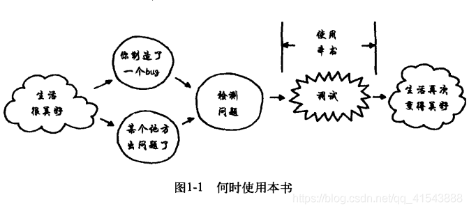

### 第1章 介简

本书的**主旨不在预防、保证或筛选**，将教给你如何准备查找bug，如何挖掘并仔细审查各种线索，以便找到根源，追踪实际问题，并修复它，然后确认你已经修复问题。

虽然本书介绍的方法和系统都是通用的，但它们都紧紧围绕一个重点，那就是**查找bug的根源并修复**。

 

###  第2章  总体规则

规则l    理解系统

规则2   制造失败

规则3   不要想，而要看

规则4   分而治之

规则5   一次只改一个地方

规则6   保持审计跟踪

规则7   检查插头

规则8   获得全新观点

规则9   如果你不修复bug，它将依然存在

###  第3章  理解系统

你必须掌握系统的工作原理以及它是如何设计的。理解系统并不等于理解问题。你现在还不理解问题，但如果你想要查明系统为什么不工作的话，必须先理解它的工作原理。

墨菲定律，事情如果有变坏的可能，不管这种可能性有多小，它总会发生。

<u>3.1 阅读手册</u>

**理解系统的基本方法就是阅读手册**

如果你是一位工程师，正在调试自己公司的产品，那么你需要读一读内部手册。工程师们设计它是用来做什么的?读一下功能说明以及所有的设计规范，研究一下图表、时序图和状态机。分析它们的代码，还要读一下注释(读一下注释，这非常重要）。一定要检查产品的设计。查明构建它的工程师们打算用它来做什么。

**手册上的信息也不可全信**

理解了你自己的系统后，当你找到bug时，必须在不破坏其它地方的前提下修复它们。理解系统行为是不破坏系统的第一步。

<u>3.2 逐字逐句阅读整个手册</u>

**应用说明和实现指南提供了丰富的信息，不仅描述了系统是如何工作的，而且专门给出了先前已发生过的问题**。常见错误的警告具有难以置信的价值（即使你犯的错误都很不常见)。从供应商的站点获取最新的文档，并阅读网站上所列出的最近一星期发现的常见错误。

参考设计和样本程序，有时这些就是能获得的全部文档了。一定要注意，创建它们的人往往只了解他们的产品，而没有遵循好的设计实践，或者不是为真实应用而设计的(最常见的缺点是不能进行错误恢复)。**不要照搬这些设计，如果你没有在开始的时候发现bug，那么将来也会发现**。此外，即使是最好的参考设计可能也不会完全符合应用程序的特定需求，而不符合的地方可能就是出问题的地方。

<u>3.3 知道什么是正常的</u>

你必须掌握一些你所工作的技术领域的基础知识。

<u>3.4 知道工作流程</u>

当你尝试寻找bug时，必须知道要查找的路线。开始时，你需要猜测在哪里把系统分隔开，以便隔离问题，这种猜测完全取决于你对系统功能划分的了解。

<u>3.5 了解你的工具</u>

很多工具提供了非常强大的功能，但只有精通它们的用户才了解。你越是精通工具，就越容易查明系统中发生了什么事情。要花时间学习与工具有关的一切，通常，查明系统行为的关键（参见规则3）是你的调试器设置得怎样，或者是否正确地触发了分析器。必须了解工具的局限性。

<u>3.6 查阅手册</u>

不要猜测，而要查阅手册。

 

###  第4章  制造失败

虽然看起来很简单，但如果不制造失败的话，调试就会变得很困难。

**口制造失败**。目的是为了观察它，找到原因，并检查是否已修复。
**口从头开始**。修车工需要知道汽车车窗在被冻结之前你洗过车。引发失败。用喷水管向漏雨的那扇窗子喷水。
**口但不要模拟失败**。用喷水管向漏雨的那扇窗子喷水，而不要向另一扇不同的、“类似的”窗子喷水。
**口查找不受你控制的条件（正是它导致了间歇性失败)**。改变能够改变的每件事情，振动、摇晃、扭曲，直到再现失败。
**口记录每件事情，并找到间歇性bug的特征。**我们的绑定系统总是只在呼叫顺序错乱时才会失败。
**口不要过于相信统计数据。**绑定问题看起来与时间段有关，但实际上真正的原因是当地的年轻人占用了电话线路。
**口要认识到“那”是可能会发生的**。甚至冰淇淋的口味也会影响汽车的发动。
**口永远不要丢掉一个调试工具**。自动击球板可能在某一天就会派上用场。

 

###  第5章 不要想，而要看

凭空想象，问题可能有几千条原因。而实际的原因只有去看了才能发现。
**口观察失败。**高级工程师看到了真实的问题，并且能够找到原因。而初级工程师们认为他们知道错误发生在哪里，结果他们修复的地方根本没有出错。
**口查看细节**。听到水泵似乎发出声音时不要停下来。到地下室查明是哪个水泵。
**口植入插装工具**。使用源代码调试器、调试日志、状态消息、信号灯和臭鸡蛋的气味。
**口添加外部插装工具**。使用分析器、示波器、量表、金属检测仪、心电图仪和肥皂泡。
**口不要害怕深入研究**。虽然它是软件成品，但它出问题了，你必须打开并修复它。
**口注意海森堡效应**。不要让仪器影响了系统。
**口猜测只是为了确定搜索的重点**。大胆地猜测内存时序发生了错误，但在修复之前应该先查看它。

 

###  第6章 分而治之

当bug的藏身之地不断被缩小一半时，它将很难再隐藏下去。
**口通过逐次逼近缩小搜索范围**。猜测1~100内的一个数字，只需7次。
**口确定范围**。如果数字是135而你却认为它在1~100内，那么你必须扩大范围。
**口确定你位于bug的哪一侧**。如果你所在的位置有排放物，则排放管就在上游。如果没有排放物，则排放管就在下游。
**口使用易于查看的测试模式。**从干净、清澈的水开始，以便当排放物进人河流中时很容易看到它。
口从有问题的一端开始搜索。如果你验证的是正确的部分，那么需要验证的地方太多了。应该从有问题的地方开始，然后向后追查原因。
**口修复已知bug**。bug互相保护，互相隐藏。因此一旦找到，立即修复它们。
**口首先消除噪声干扰**。注意那些导致系统问题的干扰因素。但对一些无足轻重的问题不要过于极端，也不要为了追求完美而去修改所有地方。

 

### 第7章  一次只改一个地方

我们在生活中要有一点先见之明。如果你所做的更改没有起到预期的作用，那么就把它改回来。它们可能会产生无法预料的影响。
**口隔离关键因素**。如果你在检查日照时间的影响，就不要改变灌溉方案。
**口用双手抓住黄铜杆**。如果你在不知道具体发生了什么问题的情况下就试图去修理核潜艇，可能会引发一次水下的切尔诺贝利爆炸°。
**口一次只改一个测试**。我之所以知道我的VGA采集相位被破坏了，就是因为其他东西都没有发生改变。
**口与正常情况进行比较**。如果所有出错的情况都有一些特征，而这些特征是正常情况所没有的，那么你就找到了问题所在。
**口确定自从上一次正常工作以来你改变了什么地方**。我的工友改变了唱机转盘上的唱头，因此这是一个很好的调试起点。

 

### 第8章 保持审计跟踪

不要只是在心里记住“保持审计跟踪”这条规则，而要把它写下来。
**口把你的操作、操作的顺序和结果全部记录下来**。你上--次喝咖啡是什么时候?你的头痛是从什么时候开始的?
**口要知道，任何细节都可能是重要的**。视频压缩芯片的崩溃是由于格子衬衫造成的。把事件关联到一起。“它发出噪声，从21:04:53开始，持续4秒”比仅仅说“它发出噪声”要好得多。
**口用于设计的审计跟踪在测试中也非常有用**。软件配置控制工具可以告诉你哪次修订引入了bug。
**口把事情记录下来!无论那个时刻多么恐怖，都要把它记到备忘录中，这样你才不会忘记。**

###  第9章  检查插头

一些显而易见的假设往往是错误的。请恕我赘述，假设错误通常是最容易修复的错误。
**口置疑你的假设**。是否运行了正确的代码?是不是燃气用完了?插头是否已插好?从头开始。是否正确地对内存进行了初始化?是否按了除草机上的“primer bulb”按钮?开关是否已打开?
**口对工具进行测试**。是否运行了正确的编译器?燃料油表是否被粘住了?量表是不是没电了?

 

###  第10章  获得全新观点

**口征求别人的意见。**甚至一个不说话的人体模特也能帮助你认识到你先前没有注意到的事情。
**口获取专业知识。**只有VGA视频采集卡的厂商才能够肯定相位功能发生了错误。
**口听取别人的经验。**别人会告诉你车内顶灯的线被挤压出来了。
**口帮助无处不在**。同事、供应商、网络，还有书店，都在等待着为你提供帮助。
**口放下面子**。bug发生了。以除掉bug为自豪，而不要非得以自己除掉bug才为自豪。
**口报告症状**，而不要讲你的理论。不要把别人拖进你的思维定式中。
**口你提出的问题不必十分肯定**。甚至连“穿了格子衬衫”这样的事情也可以提出来。

###  第11章  如果你不修复bug,它将依然存在

**口查证问题确实已被修复**。不要假设是电路的问题，而仍然让汽车带着脏的滤油嘴上路。
**口查证确实是你的修复措施解决了问题**。口中大喊“Wubba!”并不是使计算机打开的窍门。
**口要知道，bug从来不会自己消失**。使用最初导致它失败的方法再次制造失败。如果必须交付产品，那么就在产品中设计一个用于捕捉bug的“陷阱”，以便产品在客户现场发生失败时，把它捉住。
**口从根本上解决问题**。在烧坏另一台变压器之前，先把无用的8音轨磁带卡座扔掉。
**口对过程进行修复**。不要只是擦掉地上的油，而要纠正设计机器的方式。
